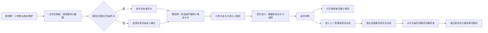

# 近邻互助组 MVP 原型设计决议

> 状态：重设计交接基线
> 日期：2026-07-29
> 本文只描述当前确认的最终方案，不记录讨论过程。客户体验原型用于验证价值理解与主流程；实施对照原型用于让工程师对照 User Story 理解状态与边界。两者都不是生产代码或视觉设计合同。

> 2026-08-10 更新：本文的群聊形态保留，但参与者改为消费者、消费者 Agent、服务者、服务者 Agent 和近邻系统 Agent，且房间严格围绕一个亲历/服务事项。详见[跨渠道 Agent 通信边界产品决议](./跨渠道Agent通信边界-产品决议.md)。

## 1. 产品定位

### 1.1 产品是什么

“近邻互助组”是消费者联盟的用户侧小程序。消费者共享自己实际购买或使用服务的经历，帮助其他消费者找到更靠谱的服务者。

产品首先服务消费者之间的互助，不以替服务者获客、制造排行榜或出售广告为中心。

### 1.2 平台从哪里介入

典型需求首先发生在平台外，例如邻居微信群。求助者不需要预先成为平台用户。

平台从消费者准备回应外部求助时介入：

1. 求助者在微信群提出需求。
2. 亲历先行者把求助截图带进近邻互助组。
3. 系统匹配或协助创建亲历推荐卡。
4. 亲历先行者把卡片发回微信群。
5. 求助者点击卡片后进入近邻互助组。

平台不需要把第一步搬进站内，也不把站内发布需求作为这条 MVP 路径的前提。

### 1.3 冷启动

第一批亲历先行者由发起方人工组织。他们贡献本人亲历、回应真实求助，但不因推荐数量获得佣金、排名或推广特权。

持续互助的基础是消费者联盟的互惠价值：今天帮助别人减少踩坑，未来自己也能使用由其他消费者贡献的亲历网络。

### 1.4 商业原则

平台不出售消费记录、关系链或私人评价。用户通过透明月卡支持产品运行。

月卡不是纯成本分摊：约一半覆盖当前 App 的运行，约一半形成毛利与跨 App 研发投入，用于继续开发其他消费者互助工具。

## 2. 角色与责任边界

| 角色 | 原型人物 | 责任 |
|---|---|---|
| 求助者 / 顾客 | 小李 | 提出需求、决定查看哪些亲历、选择与 Agent 或真人沟通 |
| 消费者 Agent | 小李的 Agent | 在小李授权范围内提问、整理和协商，不替小李作最终确认 |
| 亲历先行者 | 赵阿姨 | 只分享自己的真实消费经历，确认整理后的表述并主动发送 |
| 服务者本人 | 桃子、周师傅 | 对接单、报价、时间、服务判断和最终承诺负责 |
| 服务者 Agent | 桃子的 Agent、周师傅的 Agent | 依据服务者已确认的信息接待、答疑和收集需求，不替真人做最终承诺 |
| 近邻系统 Agent | 近邻系统 Agent | 说明权限与数据边界、整理需求、展示亲历来源、帮助寻找其他服务者；不代表任何服务者 |
| 平台组织者 | 发起团队 | 组织首批亲历先行者，维护系统与社区支持 |

所有消息必须清楚标明是真人、服务者 Agent、消费者 Agent 还是近邻系统 Agent。Agent 不得伪装成真人，近邻系统 Agent 不得伪装成消费者 Agent。

## 3. 核心体验结构

原型必须让四个外层界面彼此分开，避免求助者和亲历先行者在同一手机界面中来回切换：

1. 微信群求助。
2. 亲历先行者在近邻互助组中的操作。
3. 亲历推荐卡回到微信群后，求助者看到的状态。
4. 求助者进入近邻互助组后的体验。

## 4. 四个外层界面

### 4.1 微信群求助

- 模拟真实邻居群，不是产品内的伪群聊。
- 使用微信绿色体系和微信聊天外壳。
- 群内先有普通邻居消息，再出现小李的真实求助。
- 此时近邻互助组没有介入，也不展示推荐卡。

示例需求：附近家常菜、口味清淡、晚上 19:00 后可取，希望获得邻居的亲身经验。

### 4.2 亲历先行者操作

- 角色是赵阿姨，使用金色主题。
- 赵阿姨从微信群截图进入小程序。
- 系统从截图提取需求摘要，并自动匹配赵阿姨已有的私人亲历卡。
- 匹配成功时，可以选中卡片并直接发回微信群。
- 没有合适卡片时，可以用语音当场补录。
- Agent 只把语音整理为结构化事实，赵阿姨必须核对并确认后才能分享。
- 新补录内容明确标记为“本人陈述、尚无双方确认”，不得冒充平台已有履约证据。

### 4.3 微信群中的小程序卡片

- 赵阿姨先用自然语言回应小李，再发送小程序卡片。
- 卡片展示“谁有一段亲历可能帮到你”、服务者名称、关键匹配点和证据等级。
- 卡片必须看起来是微信中的真实小程序分享卡，而不是普通网页卡片。
- 小李点击卡片后才进入近邻互助组。

### 4.4 求助者进入小程序

- 角色是小李，使用红色主题。
- 第一次进入先展示数据承诺和月卡说明，再进入亲历详情。
- 后续核心路径是亲历详情、跨小程序查看服务、混合会话、新需求和新服务者匹配。

## 5. 首次进入：数据承诺与月卡

第一次进入必须显著表达：

> 我们不偷数据。数据属于用户。

同时说明：

- 不出售消费记录，不拿关系链换广告费。
- 亲历、评价和联系方式默认不公开，由用户决定谁能看。
- 私人记忆可以导出和删除。
- 共同确认的履约事实只保留最小记录。
- 用户付费是“不靠卖数据运行”的代价。
- 首月免费。

### 5.1 月卡阶梯

| 当前 App 用户阶段 | 月卡 |
|---|---:|
| 少于 1,000 人 | 免费 / 捐赠承担 |
| 1,000–4,999 人 | ¥20 / 月 |
| 5,000–9,999 人 | ¥15 / 月 |
| 10,000–49,999 人 | ¥10 / 月 |
| 50,000 人以上 | ¥6 / 月 |

用户越多，同一阶段所有成员的月卡越便宜。

### 5.2 1 万用户阶段的预算模型

当前 App 按“1 名程序员 + AI Agent 虚拟团队”长期运行。

| 月度项目 | 预算 |
|---|---:|
| 程序员税前工资 | ¥20,000 |
| 雇主侧社保、公积金等 | ¥4,000 |
| 开发、测试与运维 AI Agent | ¥4,000 |
| 用户侧 AI、OCR、语音与智能体调用 | ¥4,000 |
| 云服务器、数据库、存储、备份与 CDN | ¥3,000 |
| 短信、通知与消息通道 | ¥500 |
| 房租 | ¥3,000 |
| 水电与办公网络 | ¥800 |
| 开发与办公设备折旧 | ¥800 |
| 域名、证书与备案 | ¥100 |
| 微信小程序注册与认证 | ¥25 |
| 会计、法务、安全与隐私合规 | ¥2,000 |
| 税费与支付通道预留 | ¥4,000 |
| 社区运营、用户支持与线下协调 | ¥2,000 |
| 故障、价格波动与应急预备金 | ¥1,700 |
| **预计运行成本** | **约 ¥49,925** |

1 万名付费用户按 ¥10 / 月计算：

| 收入分配 | 金额 |
|---|---:|
| 月卡收入 | ¥100,000 |
| 当前 App 运行成本 | 约 ¥49,925 |
| 跨 App 研发与毛利空间 | 约 ¥50,075 |

页面必须明确：约 ¥50,075 是跨 App 研发与毛利空间，不等于最终税后净利润。上线后应公开实际收入、支出、税费和新 App 投向。

## 6. 亲历详情

亲历详情必须回答以下问题：

1. 谁把这段经验带给我？
2. 推荐人是否真的使用过？
3. 使用过几次，最近一次是什么时候？
4. 哪些事实与我这次的需求相关？
5. 这条信息是双方确认记录，还是推荐人的本人陈述？
6. 接下来如何联系或了解服务者？

### 6.1 固定信息结构

- 推荐关系：赵阿姨、所在邻里关系及分享来源。
- “下次不再显示”关系说明的选项。
- 推荐人的第一人称原话。
- 体验次数、时间新鲜度和双方确认状态。
- 与需求有关的标签，例如“清淡”“19:00 后取过”。
- 风险说明：这是有限的本人亲历，不是平台质量担保。
- 激励说明：推荐人没有推荐收益。
- 服务者本周可用信息。

### 6.2 两个主行动

- **看看本周有什么**：跳转到服务者的专属小程序。跳转前说明目标和将传递的数据，只携带用户明确授权的需求摘要。
- **先问桃子两句**：进入近邻互助组的存量用户主界面，即人 + 智能体混合会话。

## 7. 存量用户主界面：人 + 智能体混合会话

主界面不是单独与一个聊天机器人对话，而是围绕一个亲历/服务事项建立的受限五方群聊。平台不因此提供普通好友私聊或无事项大群。

### 7.1 五方参与者

1. 顾客本人。
2. 消费者 Agent。
3. 服务者本人。
4. 服务者 Agent。
5. 近邻系统 Agent。

页面顶部应能一眼看见五方身份及当前会话可见范围。近邻系统 Agent 固定参与，负责说明事项来源、房间权限、自动协作状态和真人确认边界。

### 7.2 首次进入房间的消息顺序

1. 系统提示本房间从哪里进入，以及带入了哪些需求摘要。
2. 小李的 Agent 说明已获得的需求范围和可以代为提问的事项，不代表小李作最终决定。
3. 桃子的 Agent 主动向顾客及其 Agent 打招呼，说明可以回答的内容和真人确认边界。

### 7.3 沟通规则

- 顾客可以自己发言，也可以授权自己的 Agent 自动提问、追问、整理选项和请求确认。
- 桃子本人和桃子的 Agent 都是房间成员；真人可以在同一房间查看、回复和接管。
- 双方 Agent 的后台协作如影响用户判断，必须把结论、证据来源和待确认节点投影回房间。
- 服务者 Agent 可以回答已确认的菜单、时间、流程等信息。
- 接单、报价、临时调整和最终承诺必须由服务者本人确认。
- 购买、支付、接受变更和其他高风险决定必须由消费者本人确认。
- 所有房间成员只能看到当前事项的授权摘要和房间消息，不能看到任何一方的其他对话。

## 8. 新需求与寻找其他服务者

混合会话同时是继续使用近邻互助组的入口。

顾客可以点击“我还有其他需求”：

1. 建立一个新的独立对话。
2. 默认不继承桃子房间的内容。
3. 近邻系统 Agent 引导顾客用自然语言描述新需求。
4. 系统从顾客有权查看的消费者亲历网络中寻找候选服务者。
5. 候选结果展示亲历卡数量、实际消费者人数、经验新鲜度、地理范围和可用时间。
6. 顾客选择候选人后，建立新的服务事项房间。

新的服务者房间重复同一规则：消费者及其 Agent、服务者及其 Agent、近邻系统 Agent 都是独立且可辨认的参与者。

匹配结果不是全局质量排行榜，也不等于平台担保。

## 9. 数据与会话边界

- 推荐人的评价仍属于推荐人，不因为分享卡片而转移所有权。
- 卡片落地页只展示完成当前判断所需的有限亲历。
- 每个混合会话都有独立、可见的数据范围。
- 开启新需求时，不默认复制旧服务者房间的内容。
- 跨小程序跳转只传递用户明确授权的需求摘要。
- 消费者 Agent 只使用消费者明确授权给当前服务事项的需求、偏好和证据。
- 服务者 Agent 只依据服务者已确认的信息代答。
- 近邻系统 Agent 固定参与服务事项房间，可以解释权限、整理需求、标明协作状态和提供匹配；它不冒充消费者 Agent，也不替任何一方承诺。
- 共同履约事实与私人记忆必须分开处理。

## 10. 微信与小程序外壳

### 10.1 必须保留的环境差异

- 微信群页面使用微信绿色体系，模拟真实群聊。
- 亲历先行者页面使用金色主题。
- 求助者页面使用红色主题。
- 微信聊天页面和小程序页面使用不同的导航外壳，不能混用。

### 10.2 小程序外壳

小程序页面应认真模拟微信小程序环境，包括：

- 手机状态栏的时间、信号、Wi‑Fi 和电池。
- 左上角返回。
- 居中的小程序标题。
- 右上角微信胶囊按钮：三点、分隔线和圆形标记。

设计说明、角色提示或原型 Note 必须放在手机外部，不能伪装成 App 内界面。

## 11. 重设计自由度

下一位设计 Agent 可以自由重做：

- 页面布局与信息架构。
- 字体、间距、图标、头像与组件样式。
- 聊天气泡和参与者展示方式。
- 卡片视觉、动效和导航组织。
- 具体示例文案，只要不改变语义和责任边界。
- 手机外部的讲解与原型切换方式。

下一位设计 Agent 必须保留：

- 四个外层界面及其角色分离。
- 从外部求助到亲历回应的介入时机。
- 已有亲历匹配与语音补录两条路径。
- 本人陈述与双方确认记录的证据差异。
- 第一次进入的数据承诺和透明月卡。
- 亲历推荐不是广告、佣金推荐或平台担保。
- 消费者 Agent、服务者 Agent、近邻系统 Agent 和真人的身份区分。
- 五方服务事项房间作为存量用户主界面。
- 新需求的独立会话与数据隔离。
- 从消费者亲历网络寻找新服务者的路径。
- 微信聊天与小程序外壳的真实性。

## 12. 重设计验收清单

- [ ] 能独立看懂微信群求助、亲历先行者、微信群卡片和求助者四个界面。
- [ ] 能从截图匹配已有亲历并分享到微信群。
- [ ] 能在没有匹配时通过语音补录、本人确认并分享。
- [ ] 能从微信群小程序卡片进入首次数据承诺。
- [ ] 能查看月卡阶梯、约 5 万运行成本和约 50% 跨 App 研发毛利。
- [ ] 能看懂推荐人、亲历证据等级、时间新鲜度和非担保边界。
- [ ] 能选择打开服务者专属小程序，且跳转前说明数据范围。
- [ ] 能进入桃子的五方服务事项房间。
- [ ] 能看懂消费者 Agent 的授权、自动协作和交还真人决策过程。
- [ ] 能分别与桃子的 Agent 和桃子本人沟通。
- [ ] 能提出其他需求，进入独立的新对话。
- [ ] 能查看基于消费者亲历的其他服务者候选。
- [ ] 能为新服务者建立新的五方服务事项房间。
- [ ] 小程序页面有可信的微信状态栏、返回区和右上角胶囊。

## 13. 交接参考

- [双原型入口](../index.html)
- [客户体验原型（CEP）](../prototype-customer/)
- [客户体验原型测试说明](../prototype-customer/测试说明.md)
- [实施对照原型（IRP，面向工程师）](../prototype-implementation/)
- [MVP User Stories](../user-stories/近邻互助组-MVP.md)
- [双轨原型的理论基础与边界](./双轨原型-理论基础与边界研究.md)
- [产品背景](./平台MVP-咨询转介闭环草案.md)
- [相邻方案](./地理服务场MVP-产品草案.md)
- [领域词汇](../CONTEXT.md)

对于本次重设计，以本文列出的产品决议和验收清单为准；当前 HTML 的布局、组件和视觉完成度不构成约束。
