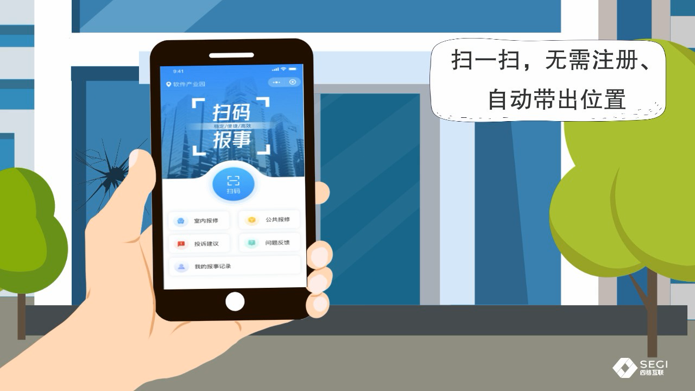
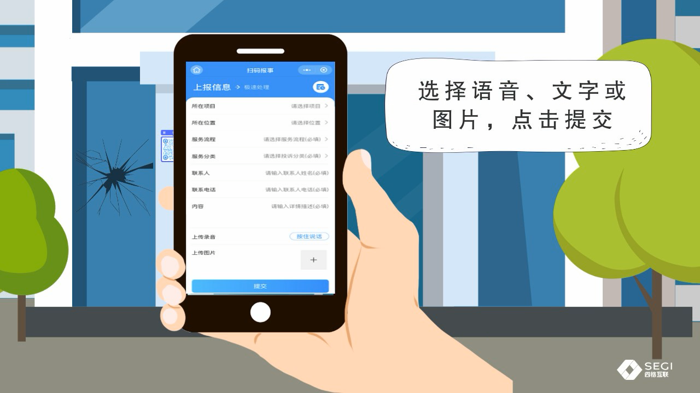
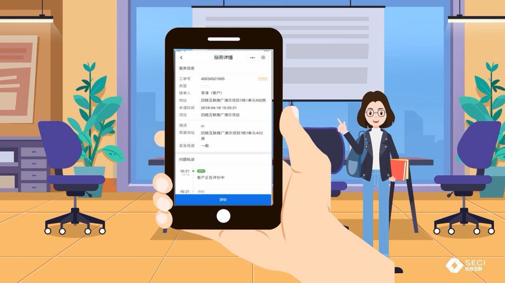
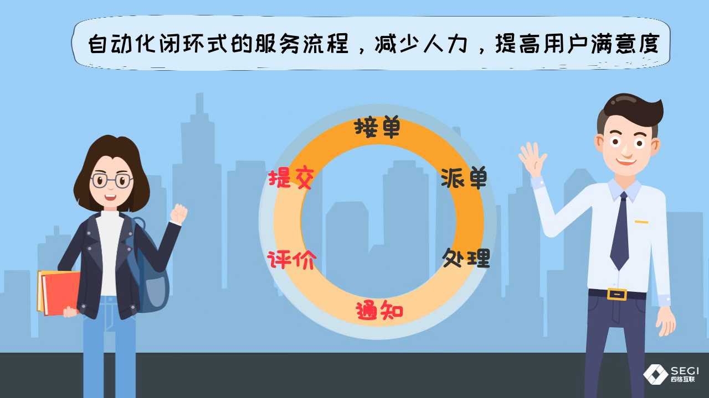
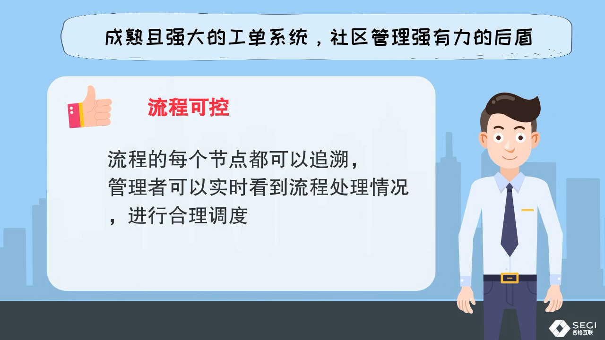

# 四格互联“公区随手拍”社区事件上报体验调研

> 调研问题：“公区随手拍”中，哪些社区事件上报与处理模式应被“邻里报一报”直接借鉴、调整后采用或明确放弃？
>
> 结论日期：2026-08-11。本文只研究深圳市四格互联信息技术有限公司的“公区随手拍”，不把同名政府服务或其他物业产品混作同一产品。

## 结论先行

“公区随手拍”最值得借鉴的不是一张上报表单，而是“现场二维码绑定物理位置 → 低门槛提交 → 工单接单/派单/处理 → 通知 → 评价”的完整链路。它把问题发现点变成入口，也让管理方获得可配置、可追溯、可统计的工单底座。[四格互联当前方案页](https://www.segiuhome.com/ywfnljjfa/1892.html)将其定义为基于物理网格区域定点、极简反馈与自动化闭环流程的区域管理系统；2021 年官方演示则直接展示了上述流程（访问：2026-08-11）。

但它不是已被公开证据证明的、具有唯一版本和统一入口的独立公众 App。当前官网把“公区随手拍”列在医院后勤方案的多个核心模块之中；深圳新东升物业项目公告描述的是“患者/工作人员扫二维码提交、员工在移动工作平台处理、后台跟进”的客户化部署；城奥大厦案例又把它与巡查、会议室和客户服务并列。由此更稳妥的判断是：它是可配置、可嵌入客户系统的 B2B 区域管理模块，居民入口可以是场所二维码，员工入口和后台则随项目集成；未找到它作为统一独立公众 App 的一方商店条目或固定入口。[当前方案页](https://www.segiuhome.com/ywfnljjfa/1892.html)、[深圳新东升项目公告](https://www.segiuhome.com/companynews/1772.html)、[城奥大厦案例](https://www.segiuhome.com/companynews/1743.html)（访问：2026-08-11）。

对“邻里报一报”的核心判断是：直接采用“空间即入口”和“端到端状态闭环”；调整企业工单逻辑为邻里可见、可补充、可合并、可重开的协作事件；放弃强制联系人、只在后台流转和以五星评分替代事实验收。否则它会从“共同处理公共问题”退化为单向投诉箱。

## 1. 基准锁定与证据等级

### 1.1 研究对象与观察版本

| 证据 | 能证明什么 | 不能证明什么 |
|---|---|---|
| [四格互联医院后勤管理方案](https://www.segiuhome.com/ywfnljjfa/1892.html)（当前官网页面；访问：2026-08-11） | 厂商当前仍将“公区随手拍”列为后勤方案中的核心模块，并声明物理网格定点、极简反馈、自动闭环及多场景定位 | 具体客户配置、当前 UI、真实效果指标 |
| [“公区随手拍”官方视频列表](https://www.segiuhome.com/video/2034.html?page=2)与[官方 MP4](https://www.segiuhome.com/static/upload/other/20210923/1632361061693174.mp4)（媒体路径日期 2021-09-23，128 秒；访问：2026-08-11） | 可直接观察居民入口、上报字段、服务详情、评价、闭环节点及厂商展示的管理能力 | 2026 年统一产品 UI、真实生产环境、处理端页面；视频中的示例工单日期为 2018-04-18，说明它是演示素材而非当前线上实测 |
| [北京城奥置业案例](https://www.segiuhome.com/companynews/1743.html)（发布：2024-10-29；访问：2026-08-11） | 厂商声明城奥大厦持续使用公区随手拍，并与巡查、会议室、客户服务模块协同 | 使用规模、处理时效、实际界面与用户反馈 |
| [深圳新东升物业医院项目公告](https://www.segiuhome.com/companynews/1772.html)（发布：2025-03-18；访问：2026-08-11） | 厂商公布的建设方案包含公区随手拍；患者/工作人员扫二维码提交卫生和安全隐患需求，员工用移动工作平台处理，后台跟进 | 公告使用“建成后的系统”，因此不能当作已经上线并验证成效的生产报告 |

本文将内容标成四类：**直接观察**（官方视频可见）、**厂商陈述**（官网文字）、**推断**（由多项证据组合得出）和**证据缺口**（公开材料没有回答）。未引入第二个“随手拍”比较产品来填空，以免把别的产品能力误写成四格互联的产品事实。

### 1.2 产品形态判断

**推断：它首先是模块，不是单一终端。** 当前方案把它和中央运送、设备运维、综合巡查等并列；城奥案例也把它与多项物业功能并列；深圳医院部署同时出现二维码居民入口、员工移动工作平台和后台。因此，原型不应照抄某个“App 首页”，应抽取“空间入口、事件模型、工单状态、角色端”四层能力。[当前方案页](https://www.segiuhome.com/ywfnljjfa/1892.html)、[城奥大厦案例](https://www.segiuhome.com/companynews/1743.html)、[深圳新东升项目公告](https://www.segiuhome.com/companynews/1772.html)（访问：2026-08-11）。

**证据缺口：** 未找到公开材料证明该产品有统一小程序名称、App 包名、统一登录体系或跨客户通用的当前版本号；也没有客户方自有官网或应用商店说明能把某一具体部署反向确认为四格互联交付。以下界面均应称为“2021 官方演示界面”，而非“当前线上界面”。

## 2. 官方视频中的流程与屏幕记录

### 2.1 居民路径

1. **在事件现场扫码。** 演示把二维码贴在建筑公共区域，用户扫描进入；画面明确写着“无需注册、自动带出位置”。首页同时出现“扫码报事、室内报修、公共报修、投诉建议、问题反馈、我的报事记录”等入口。[官方视频 00:54–01:01](https://www.segiuhome.com/static/upload/other/20210923/1632361061693174.mp4#t=54)（直接观察；访问：2026-08-11）。
2. **填写一页上报表单。** 演示表单可见“所在项目、所在位置、服务流程、服务分类、联系人、联系电话、内容、上传录音、上传图片”；其中服务流程、服务分类、联系人、联系电话和内容标为必填，随后点击“提交”。画外文字概括为选择语音、文字或图片后提交。[官方视频 01:04–01:08](https://www.segiuhome.com/static/upload/other/20210923/1632361061693174.mp4#t=64)（直接观察；访问：2026-08-11）。
3. **查看服务详情与问题轨迹。** 演示详情页可见工单号、提单人、地址、申请时间、项目、描述、房屋地址、紧急程度和“问题轨迹”，底部提供“评价”；示例页的紧急程度为“一般”，但视频没有展示紧急程度由谁填写或如何计算。[官方视频 01:12–01:15](https://www.segiuhome.com/static/upload/other/20210923/1632361061693174.mp4#t=72)（直接观察；访问：2026-08-11）。
4. **五星与文字评价。** 下一屏是五星评分、文字评价框和提交按钮。[官方视频 01:15–01:18](https://www.segiuhome.com/static/upload/other/20210923/1632361061693174.mp4#t=75)（直接观察；访问：2026-08-11）。

*图 1：官方视频 01:00 原始帧；来源：[四格互联官方视频](https://www.segiuhome.com/static/upload/other/20210923/1632361061693174.mp4#t=60)（访问：2026-08-11）。*

*图 2：官方视频 01:06 原始帧；来源：[四格互联官方视频](https://www.segiuhome.com/static/upload/other/20210923/1632361061693174.mp4#t=66)（访问：2026-08-11）。*

*图 3：官方视频 01:14 原始帧；来源：[四格互联官方视频](https://www.segiuhome.com/static/upload/other/20210923/1632361061693174.mp4#t=74)（访问：2026-08-11）。*

### 2.2 处理路径

公开视频没有展示处理人员真实操作界面，但明确画出“提交 → 接单 → 派单 → 处理 → 通知 → 评价”的环形流程；随后声明流程可按需求配置、每个节点可追溯、管理者可实时查看处理情况并调度，以及按多维度统计工单。[官方视频 01:28–01:50](https://www.segiuhome.com/static/upload/other/20210923/1632361061693174.mp4#t=88)（“节点与画面”属直接观察，“减少人力/提升满意度”等效果属厂商陈述；访问：2026-08-11）。

深圳新东升项目进一步描述了端的分工：患者和工作人员通过二维码提交公区卫生、安全隐患服务需求，员工通过移动工作平台处理任务，后台自动跟进；但该公告没有把“智能派单”明确限定在公区随手拍，且是建设方案表述，所以不能据此断言公区随手拍已自动选人派单。[深圳新东升项目公告](https://www.segiuhome.com/companynews/1772.html)（厂商陈述；访问：2026-08-11）。

*图 4：官方视频 01:34 原始帧；来源：[四格互联官方视频](https://www.segiuhome.com/static/upload/other/20210923/1632361061693174.mp4#t=94)（访问：2026-08-11）。*

*图 5：官方视频 01:43 原始帧；来源：[四格互联官方视频](https://www.segiuhome.com/static/upload/other/20210923/1632361061693174.mp4#t=103)（访问：2026-08-11）。*

## 3. 逐项回答关键产品问题

| 问题 | 已核验事实 | 公开证据缺口及解释 |
|---|---|---|
| 登录、实名、小区选择 | 演示明确写“扫码、无需注册”；同时上报表单强制联系人和联系电话，并提供“所在项目、所在位置”选择。[官方视频 01:00、01:06](https://www.segiuhome.com/static/upload/other/20210923/1632361061693174.mp4#t=60)（直接观察；访问：2026-08-11） | 未见身份证明、手机号校验或住户认证，故“必填联系人”不等于实名制；未见名为“小区选择”的步骤，也不知道二维码是否会完全锁定项目/位置。 |
| 位置确认 | 厂商称产品基于“物理网格区域定点技术”；演示称二维码自动带出位置，但同一演示表单仍显示项目、位置选择项。[当前方案页](https://www.segiuhome.com/ywfnljjfa/1892.html)、[官方视频 01:00–01:06](https://www.segiuhome.com/static/upload/other/20210923/1632361061693174.mp4#t=60)（厂商陈述与直接观察；访问：2026-08-11） | 未展示预填后的值、用户确认/纠错、定位粒度和二维码被移动后的处理。两处画面不能证明“完全免选位置”，只能确认二维码定位是设计意图。 |
| 图片、文字、分类 | 演示支持文字详情、按住录音、上传图片；服务流程和服务分类必填。[官方视频 01:04–01:08](https://www.segiuhome.com/static/upload/other/20210923/1632361061693174.mp4#t=64)（直接观察；访问：2026-08-11） | 未公开图片数量/大小、拍摄或相册来源、分类树内容、“不知道分类”兜底及敏感图片提示。 |
| 紧急程度 | 服务详情展示“紧急程度：一般”。[官方视频 01:14](https://www.segiuhome.com/static/upload/other/20210923/1632361061693174.mp4#t=74)（直接观察；访问：2026-08-11） | 上报表单没有可见的紧急程度字段；无法判断它由分类规则、处理人还是隐藏配置产生，也没有紧急事件分流规则。 |
| 提交与状态跟踪 | 首页有“我的报事记录”，详情页有“问题轨迹”，闭环图包含通知和评价。[官方视频 01:00、01:14、01:34](https://www.segiuhome.com/static/upload/other/20210923/1632361061693174.mp4#t=60)（直接观察；访问：2026-08-11） | 未展示完整状态名称、预计时限、超时、处理证据、通知渠道或用户能看到的每次内部流转。 |
| 补充、撤回、重新上报 | 无公开证据。 | “我的报事记录”和“问题轨迹”不能推出补充、撤回或重报能力；官方演示没有这些操作。 |
| 接单、派单、处理 | 闭环图明确包含接单、派单和处理；厂商还声明流程可配置、节点可追溯、管理者可实时查看并调度。[官方视频 01:34–01:43](https://www.segiuhome.com/static/upload/other/20210923/1632361061693174.mp4#t=94)（直接观察与厂商陈述；访问：2026-08-11） | 未展示谁接单、派给个人还是班组、自动还是人工、拒单/转派/协办/升级规则；没有公开处理端 UI。 |
| 重复问题 | 无公开证据。 | 未见同地点相似事件检测、合并、关联或“已有问题，我也遇到”机制。 |
| 办结与重开 | 闭环以“通知 → 评价”回到流程起点，详情页在“客户正在评价中”时提供评价入口。[官方视频 01:14、01:34](https://www.segiuhome.com/static/upload/other/20210923/1632361061693174.mp4#t=74)（直接观察；访问：2026-08-11） | 未说明评价是否构成办结、未评价如何自动关闭、用户不认可时能否退回/重开，以及处理人是否必须提交结果照片。 |
| 隐私、滥用与责任边界 | 演示表单收集联系人、电话、地址和图片；官网列出的场景包含公区报修、安全隐患、环境卫生、投诉建议、民生问题等。[官方视频 01:06、01:54](https://www.segiuhome.com/static/upload/other/20210923/1632361061693174.mp4#t=66)（直接观察；访问：2026-08-11） | 未找到模块专属隐私政策、保存期限、处理方可见范围、照片脱敏、匿名上报、虚假/恶意上报处置、紧急事件提示或物业/社区/政府责任分界。公司官网通用隐私条款不能替代客户部署的产品规则。 |

## 4. 核心功能与交互模式拆解

| 层 | 核心功能 | 交互模式 | 对“邻里报一报”的意义 |
|---|---|---|---|
| 空间入口 | 物理网格与二维码绑定 | 在问题发生地扫码，尝试带出项目和位置 | 让“这是哪里的问题”由环境提供，不让居民从长列表找小区、楼栋、楼层 |
| 信息采集 | 文字、录音、图片、流程、分类、联系人 | 单页表单，多模态补充 | 保留少量结构化字段，但应把最常用路径压缩到“一张图 + 一句话” |
| 事件/工单 | 接单、派单、处理、通知、评价 | 状态机推动不同角色行动 | 居民端与处理端必须共享同一事件，而不是各自保存一份消息 |
| 反馈闭环 | 我的报事记录、问题轨迹、通知、评价 | 提交后回看、结果后反馈 | “已解决”必须可见、可核验、可质疑，而不只是后台改状态 |
| 管理运营 | 流程配置、节点追溯、实时调度、统计分析 | 后台按项目与场景配置 | 原型先固定最小流程，待真实事件积累后再开放配置和统计 |
| 多场景部署 | 公区报修、安全隐患、环境卫生、投诉建议、民生问题等；并覆盖医院、园区、写字楼等业态 | 同一模块按客户和空间复用 | 证明“空间事件”是比“投诉”更稳的核心模型，但不应把企业级全场景一次塞进社区 MVP |

前三层由当前方案、2021 官方演示和深圳医院部署共同支持；管理运营与多场景是厂商在视频和方案中的能力陈述，不是本文独立验证的效果结论。[当前方案页](https://www.segiuhome.com/ywfnljjfa/1892.html)、[官方视频 01:34–02:00](https://www.segiuhome.com/static/upload/other/20210923/1632361061693174.mp4#t=94)、[深圳新东升项目公告](https://www.segiuhome.com/companynews/1772.html)（访问：2026-08-11）。

## 5. 直接借鉴 / 调整后采用 / 明确放弃

以下均为项目建议，不是对四格互联现状的事实描述。

| 决策 | 模式 | 用于“邻里报一报”的做法 |
|---|---|---|
| **直接借鉴** | 空间二维码作为入口 | 每个公共位置生成稳定二维码，码中只放空间标识；打开后明确展示“当前：X 栋 X 层公共区”，一键确认。 |
| **直接借鉴** | 提交到评价的完整状态链 | 事件必须有居民可见的时间线；处理结果主动通知，结束时让发起人确认。 |
| **直接借鉴** | 图片、文字、语音多模态 | 图片为主，短文字或语音任选其一补充；结构化信息只保留位置、类别和安全紧急性。 |
| **直接借鉴** | 同一事件支撑多角色 | 发起人、其他邻居、物业/志愿者/社区处理人围绕同一个事件协作，避免复制粘贴到群聊和后台。 |
| **调整后采用** | “无需注册”与联系人必填并存 | 扫码先允许低摩擦提交；联系方式默认选填且仅处理人可见。只有需要私下核实或涉及个人权益时再请求验证，不把姓名/手机设为所有事件的前置门槛。 |
| **调整后采用** | 自动带出位置 | 自动带出后必须显式确认，并提供“位置不对”纠错；二维码绑定点位而非个人，防止码被移动后静默错报。 |
| **调整后采用** | 服务流程、服务分类必填 | 居民只选易懂的事件类别，并提供“不确定”；内部责任流由系统映射，不让居民理解组织架构。安全紧急性单独询问。 |
| **调整后采用** | 通知后评价 | 改为“已解决 / 还没解决 / 需要补充”，并允许重开；五星可作为非关键附加反馈，不作为关闭事实的唯一依据。 |
| **调整后采用** | 可配置工作流与数据统计 | MVP 固定最短状态机；先验证是否有人接、是否真解决，再逐步增加超时、转派和统计，避免先造企业后台。 |
| **明确放弃** | 所有上报强制联系人和手机号 | 会提高摩擦并扩大公共空间照片与个人身份绑定的风险，不符合低门槛邻里互助。 |
| **明确放弃** | 只让后台看见流转 | 私有工单适合物业客服，却不够支撑邻里共同发现、补充和监督；至少公开去身份化状态与处理进展。 |
| **明确放弃** | 每次发现都生成独立工单 | 同地点、同问题应先提示已有事件，允许“我也遇到”或补图；否则重复量会淹没处理队列。 |
| **明确放弃** | 把“系统自动闭环”当成产品承诺 | 闭环的关键是责任人、证据、确认与重开，而非状态自动跳转；原型不承诺自动识别责任单位或自动办结。 |

## 6. 避免成为单向投诉箱

“公区随手拍”在结构上并非纯粹的单向投递：官方演示包含记录、问题轨迹、通知和评价，也把“用户反馈渠道复杂、处理结果通知慢”列为要解决的问题。[官方视频 00:28–00:42、01:12–01:34](https://www.segiuhome.com/static/upload/other/20210923/1632361061693174.mp4#t=28)（直接观察与厂商陈述；访问：2026-08-11）。

不过，公开视频呈现的关系仍然是“用户 → 管理方 → 用户”的私有客服闭环，没有展示邻居看见同一问题、补充证据、共同认领或监督的能力，也没有展示补充、撤回、重复合并和重开。**因此，如果“邻里报一报”只复刻扫码表单与内部派单，它仍会成为体验更顺滑的投诉箱，而不是邻里协作工具。**

要改变这一点，事件应在隐私允许的范围内成为“小区公共对象”：邻居可看到去身份化摘要、关注进展、补充照片或表示“我也遇到”；处理人公开认领并持续更新；发起人和受影响邻居都能对“已解决”提出异议。私密投诉、涉及个人或敏感位置的事项则转入仅当事人与处理人可见的通道。

## 7. 给“邻里报一报”原型的 5 条具体建议

1. **把二维码做成位置令牌。** 扫码页首屏显示“X 小区 · X 栋 · X 层公共区”，默认确认但可纠错；不要先登录或先选社区。二维码失效、被移动或位置过粗时给出可恢复路径。
2. **把上报压到一屏。** 现场照片为主要证据，文字或语音任选；类别先用“环境卫生 / 设施损坏 / 通行占用 / 安全隐患 / 其他”，另设“是否有人身安全风险”。联系方式默认选填并说明谁能看到。
3. **采用可重开的共享状态机。** 建议状态为“待响应 → 已认领 → 处理中 → 待确认 → 已解决”，另有“需要补充 / 已合并 / 已撤回 / 已重开”；每次变更记录角色、时间、说明和处理照片。
4. **先去重再提交。** 扫码后先展示该点位仍开放的相似事件，允许用户“同样遇到 +1”、补图或补充描述；只有确实不同才新建事件。合并必须保留每位贡献者的反馈渠道。
5. **同时做居民视图和处理视图。** 居民看到去身份化公共事件流、认领者与进度；处理人看到待认领、超时和需要补充的队列。闭环以处理证据和居民确认/可重开为准，不以五星评分或后台按钮单方面结束。

## 8. 仍需通过原型或客户访谈验证

- 二维码究竟携带项目、网格、精确点位中的哪些字段；位置能否被居民确认和纠错。
- 无注册提交如何在“我的报事记录”中找回事件，联系人是否可选，以及手机号是否校验。
- 处理端的接单、自动/人工派单、转派、协办、超时和关单规则及真实界面。
- 补充、撤回、重新上报、退回重办和重复事件合并是否存在。
- 处理结果需要何种证据，评价与办结的先后关系，未评价时如何处理。
- 模块级隐私政策、图片与联系方式可见范围、保存期限、内容审核、恶意上报与紧急事件责任边界。
- 深圳新东升项目是否已按公告上线；若已上线，应由客户方验证实际入口、处理时效和使用数据，而不是继续引用建设期厂商陈述。
