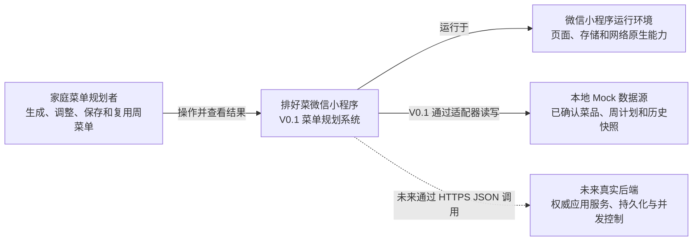
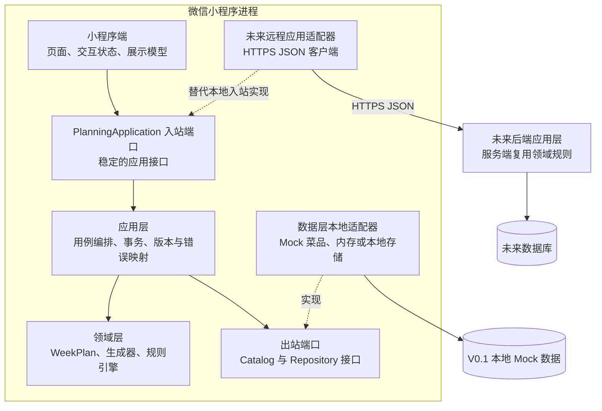
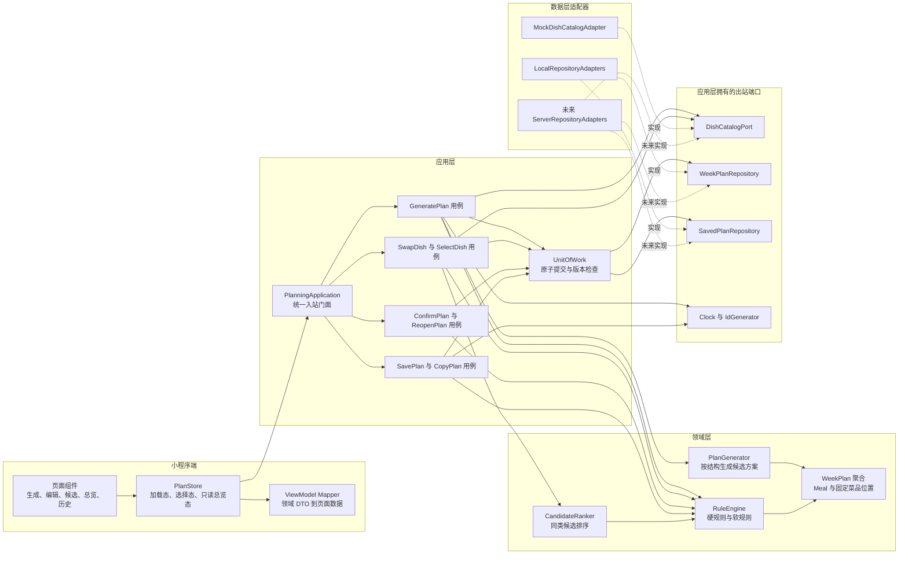

# 排好菜 V0.1：架构模型

本文定义后续实现应遵守的静态边界。它描述的是**目标实现模型**，不是对现有演示原型已具备能力的声明。当前客户原型以 React 内存状态和固定示例数据表达交互；V0.1 实现先使用本地 Mock 适配器，未来真实后端必须复用相同的应用入口和领域契约。

## 1. 范围基线

### V0.1 范围

- 单个本地家庭工作区，无登录；选择一个以周一开始的工作周。
- 一次生成周一至周五的午饭、晚饭，共 `5 天 × 2 餐 = 10 餐`。
- 每餐固定 `2 荤 + 2 素 + 1 汤`，只使用状态为“已确认”的菜品。
- 在周菜单中按稳定位置换一道，或从同类候选中手选；其他位置不变。
- 对硬规则作阻断校验，对近期重复、主料重复等软规则给出可保留的提醒。
- 确认、保存一周菜单；从历史保存快照复制到另一周并继续调整。
- 菜品库只读浏览和类型筛选；数据来自明确标注的本地 Mock。
- 用版本号保护并发写入，用原子写语义保护保存结果。

### V0.1 非范围

- 微信登录、家庭成员/权限、多设备或云同步。
- 菜品录入、编辑、审核、导入及图片管理。
- 个性化推荐、机器学习、营养/过敏/疾病约束及真实推荐算法。
- 周末、早餐、加餐、自定义餐次或自定义每餐结构。
- 采购清单、库存、价格、订单、支付、配送和对账。
- 消息通知、分享协作、运营后台、数据分析和跨家庭数据。
- 离线与云端的双向合并；V0.1 只有单一活动写入源。

若产品要突破以上任一固定条件，应先升级 [contracts.md](./contracts.md) 的类型、规则和不变量，而不是在 UI 或适配器中加入特例。

## 2. 三级系统模型

### 2.1 系统上下文



边界说明：微信只提供运行平台能力，不拥有菜单领域规则；本地 Mock 与未来后端是互斥的活动数据源，不允许一次命令同时写两边。

### 2.2 容器模型



图中的实线表示运行时调用，虚线表示接口实现或替换关系。V0.1 中 `Inbound → App → Domain` 位于小程序进程内；接入真实后端后，小程序 UI 仍依赖 `PlanningApplication`，但由 `RemoteAdapter` 完成调用，权威的应用层、领域层和数据事务迁移到服务端。

### 2.3 组件模型



`PlanStore` 只保存页面加载、当前选中位置、筛选模式等交互状态，以及应用接口返回的最新 `WeekPlan`；它不能自行改写领域对象。所有菜单变更必须经应用用例并返回新版本。

## 3. 分层职责

| 层 | 应负责 | 不应负责 |
| --- | --- | --- |
| 小程序端 | 路由与页面状态；展示五天十餐；提交命令；呈现 `RuleViolation` 和可恢复错误；按无障碍要求标注选择态、加载态和错误态 | 生成菜单、判断荤素结构、静默修复领域错误、直接访问本地存储或拼接后端 URL |
| 应用层 | 实现 `generatePlan`、`swapDish`、`selectDish`、`confirmPlan`、`savePlan`、`copyPlan` 等用例；装载聚合；校验 `expectedVersion`；界定事务；调用规则；映射统一错误 | 在页面组件中泄漏仓储细节；重复实现领域不变量；把存储异常伪装为成功 |
| 领域层 | 定义对象、状态机与不变量；生成满足结构的计划；同类候选排序；输出硬/软规则结果；保证单道修改只改变目标位置 | 依赖微信 API、HTTP、LocalStorage、数据库或 React；决定提示文案布局 |
| 数据层 | 通过端口加载菜品、草稿和保存快照；序列化；原子提交；实现版本比较；把平台异常转换为存储错误 | 决定菜单结构或放宽规则；让 UI 直接依赖某种持久化格式 |

横切要求：输入验证发生在入站端口和数据反序列化边界；日志不得记录未来可能出现的个人敏感数据；后端上线后必须在服务端重跑硬规则，不能信任客户端已校验的结果。

## 4. 依赖方向与端口/适配器边界

### 4.1 源码依赖规则

源码依赖始终向内：

```text
小程序端 → 应用层 → 领域层
数据适配器 → 应用层定义的端口 → 领域类型
```

- 领域层是最内层，不导入平台 SDK、UI 框架和存储实现。
- 应用层可以依赖领域层和自己拥有的端口声明，不依赖具体适配器。
- 小程序端只依赖 `PlanningApplication` 入站端口及返回 DTO。
- 数据层反向实现端口；用依赖注入在启动时组装，不通过全局单例越层调用。
- 运行时调用方向与源码依赖方向不必相同。例如应用层调用 `WeekPlanRepository`，但具体仓储模块在源码上依赖该端口。

### 4.2 端口清单

| 端口 | 方向 | 责任 | V0.1 适配器 | 未来适配器 |
| --- | --- | --- | --- | --- |
| `PlanningApplication` | 入站 | 为页面提供命令和查询，统一 `Result`、版本和错误 | 进程内应用门面 | `RemotePlanningApplicationAdapter` |
| `DishCatalogPort` | 出站 | 按 ID/类型读取菜品和菜品库版本 | 固定 Mock 数据集 | 服务端菜品仓储 |
| `WeekPlanRepository` | 出站 | 读取活动计划；按 `expectedVersion` 原子写入 | 内存测试仓储或本地存储 | 数据库仓储 |
| `SavedPlanRepository` | 出站 | 保存、读取和列出不可变历史快照；约束目标周唯一性 | 本地存储 | 数据库仓储 |
| `Clock` | 出站 | 提供可测试的当前时间 | 固定/系统时钟 | 服务端时钟 |
| `IdGenerator` | 出站 | 产生不依赖名称和数组下标的 ID | UUID/测试序列 | 服务端 UUID/ULID |

端口方法与 DTO 草案见 [contracts.md](./contracts.md)。

## 5. 本地 Mock 与真实后端的切换边界

### V0.1 本地模式

1. 启动组合根创建进程内 `PlanningApplication`、领域服务和本地适配器。
2. `MockDishCatalogAdapter` 读取明确标注为 Mock 的固定菜品数据和 `catalogVersion`。
3. 活动 `WeekPlan` 与不可变 `SavedPlan` 经 Repository 端口写入本地存储；单元测试换成内存仓储。
4. Mock 适配器也必须执行序列化校验、版本比较和原子提交，不能因为是演示数据就绕过契约。

### 未来后端模式

1. 组合根把 UI 所依赖的 `PlanningApplication` 换成远程适配器；页面和 ViewModel 不变。
2. 远程适配器只负责 HTTPS、鉴权头、超时、重试边界和 JSON/错误映射，不在客户端复制服务端业务规则。
3. 进程内应用层与领域层迁移到服务端，服务端 Repository 适配数据库并成为唯一权威写入源。
4. HTTP DTO 保持可 JSON 序列化：日期使用 `YYYY-MM-DD`，枚举使用契约中的大写字符串，禁止传 `Date`、`Map`、类实例或 `undefined`。
5. 切换期间不得双写本地与远端。若要做离线同步，应另立版本设计冲突合并、操作日志和身份边界，不属于 V0.1。

### 替换验收条件

- 对同一组应用层契约测试，内存、本地存储和服务端适配器给出相同的成功/错误语义。
- `VERSION_CONFLICT`、`STORAGE_FAILURE`、`HARD_RULE_VIOLATION` 等错误码不因传输方式改变。
- 任何远端失败都不能先在 UI 中伪造成功；保存成功必须代表服务端事务已提交。

## 6. 关键架构决策

1. **`WeekPlan` 是唯一变更聚合。** `Meal` 和菜品位置通过 `WeekPlan` 命令修改，防止单餐更新绕过整周重复规则和版本控制。
2. **确认态与保存快照分离。** 确认把活动计划切到只读 `CONFIRMED`；保存原子地产生不可变 `SavedPlan` 并把来源计划标记为 `SAVED`。返回修改时显式 `reopenPlan`。
3. **位置而不是数组下标构成命令目标。** 命令使用 `mealId + position`；同类替换保留位置种类，其他 49 个位置不变。
4. **软规则只告警，硬规则才阻断。** 两类结果使用同一 `RuleViolation` 结构，但应用结果分栏返回，UI 不从文案猜测严重程度。
5. **历史保存领域快照。** `SavedPlan` 保存菜名、种类、主料等必要摘要；以后菜品被停用或改名，不得篡改历史菜单。
6. **乐观并发由契约承担。** 每次变更提交 `expectedVersion`，成功后聚合版本加一；版本冲突要求重新加载，禁止后写覆盖先写。
7. **生成可重放。** 生成和自动换菜接收种子或由应用层生成并回传，测试能够对同一菜品库版本和规则版本复现结果；这不等同于真实推荐算法。

这些决策共同保证后续团队能从页面动作追踪到应用入口、领域变更、数据提交和可测试的返回结果。
