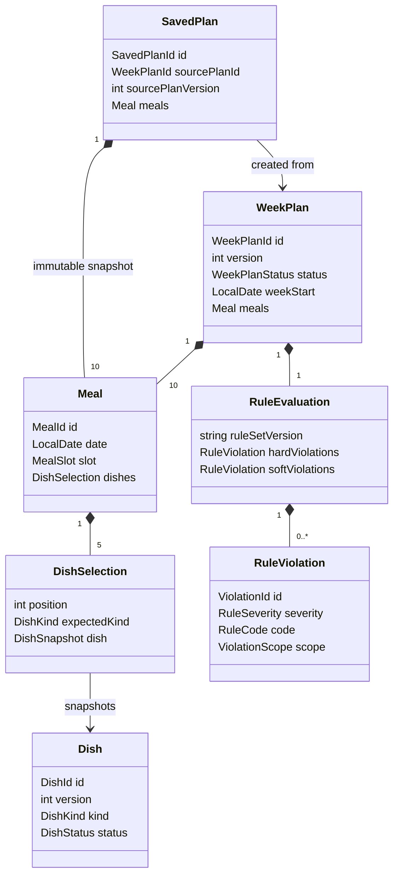
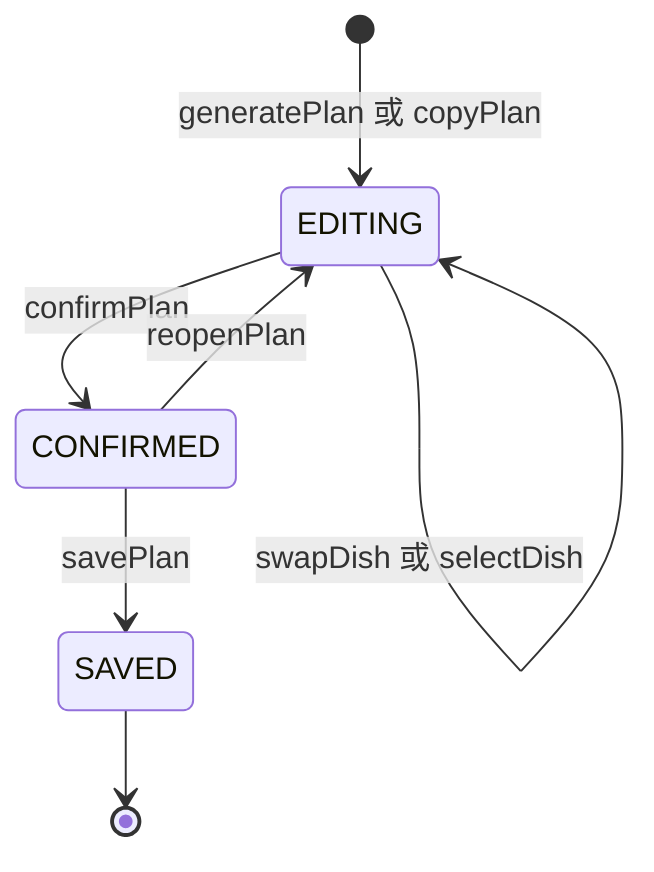

# 排好菜 V0.1：领域与应用契约

本文是产品、前端、后端和测试共同使用的可实现契约。示例接口接近 TypeScript，但不绑定框架、传输协议或数据库。所有数据均为本地 Mock 阶段的目标结构，不代表真实后端已经存在。

## 1. 契约约定

- 领域枚举在代码和 JSON 中使用大写英文常量；中文只用于 UI 文案。
- 所有日期是本地日历日期 `YYYY-MM-DD`，不使用时间戳推导餐次日期；时间点使用 ISO 8601 UTC 字符串。
- ID 是不透明 UUID/ULID，不从菜名、日期或数组下标推导。
- `version` 是聚合修订号；`schemaVersion` 是序列化结构版本；`catalogVersion` 和 `ruleSetVersion` 分别标识菜品库与规则集。四者不得混用。
- 应用命令采用乐观并发：现有计划的修改必须提交 `expectedVersion`，成功后 `WeekPlan.version + 1`。
- 领域对象按不可变值处理。应用接口返回新对象，前端不能在原对象上直接改数组。
- 失败结果不产生部分写入；软规则不是失败。

## 2. 对象关系与生命周期

### 2.1 对象关系



`DishSelection` 是菜品在某餐固定位置上的值对象，不是独立聚合。活动计划和保存记录都携带 `DishSnapshot`：活动计划据此稳定展示，保存记录据此保证菜品改名或停用后历史不变。

### 2.2 生命周期



- `EDITING`：允许单道修改；每次成功修改增加版本并重新校验整周。
- `CONFIRMED`：总览只读；仍可通过 `reopenPlan` 显式返回编辑态。
- `SAVED`：来源活动计划终态；`savePlan` 同时创建一个独立、不可变的 `SavedPlan`。
- `copyPlan` 不复活或修改历史对象，而是从 `SavedPlan` 创建新 ID、新餐次 ID、`version = 1` 的 `EDITING` 计划。

菜品生命周期为 `DRAFT → CONFIRMED → DISABLED`。菜品维护不在 V0.1 UI 范围内；Mock 数据从 `CONFIRMED` 开始。只有 `CONFIRMED` 菜品可进入活动计划，`DISABLED` 菜品的既有历史快照仍可读取。

## 3. TypeScript 伪类型

### 3.1 基础类型与枚举

```ts
type Brand<T, Name extends string> = T & { readonly __brand: Name };

type DishId = Brand<string, "DishId">;
type MealId = Brand<string, "MealId">;
type WeekPlanId = Brand<string, "WeekPlanId">;
type SavedPlanId = Brand<string, "SavedPlanId">;
type ViolationId = Brand<string, "ViolationId">;
type CommandId = Brand<string, "CommandId">;
type LocalDate = Brand<string, "LocalDate">;       // YYYY-MM-DD
type Instant = Brand<string, "Instant">;           // ISO 8601 UTC

type DishKind = "MEAT" | "VEGETABLE" | "SOUP";
type MealSlot = "LUNCH" | "DINNER";
type DishStatus = "DRAFT" | "CONFIRMED" | "DISABLED";
type WeekPlanStatus = "EDITING" | "CONFIRMED" | "SAVED";
type RuleSeverity = "HARD" | "SOFT";

type DishPosition = 0 | 1 | 2 | 3 | 4;

type JsonPrimitive = string | number | boolean | null;
type JsonValue = JsonPrimitive | JsonObject | readonly JsonValue[];
interface JsonObject {
  readonly [key: string]: JsonValue;
}
```

固定位置的种类映射如下，前后端和测试不得各自猜测：

| `position` | `expectedKind` | UI 含义 |
| ---: | --- | --- |
| `0` | `MEAT` | 荤菜 1 |
| `1` | `MEAT` | 荤菜 2 |
| `2` | `VEGETABLE` | 素菜 1 |
| `3` | `VEGETABLE` | 素菜 2 |
| `4` | `SOUP` | 汤 1 |

### 3.2 菜品与餐次

```ts
interface Dish {
  readonly id: DishId;
  readonly schemaVersion: 1;
  readonly version: number;                    // 正整数
  readonly name: string;                       // trim 后 1..80 字符
  readonly kind: DishKind;
  readonly mainIngredientKeys: readonly string[]; // 规范化稳定键，不是展示名
  readonly status: DishStatus;
  readonly updatedAt: Instant;
}

interface DishSnapshot {
  readonly id: DishId;
  readonly version: number;                    // 生成/选择时的 Dish.version
  readonly name: string;
  readonly kind: DishKind;
  readonly mainIngredientKeys: readonly string[];
}

interface DishSelection {
  readonly position: DishPosition;
  readonly expectedKind: DishKind;
  readonly dish: DishSnapshot;
}

interface Meal {
  readonly id: MealId;
  readonly date: LocalDate;
  readonly slot: MealSlot;
  readonly dishes: readonly DishSelection[];   // 必须恰好 5 项并按 position 升序
}
```

`mainIngredientKeys` 用于避重，例如展示名“牛肉”可映射为稳定键 `beef`。V0.1 不定义营养或过敏语义，不能把该字段扩张成医疗约束。

### 3.3 活动计划、规则结果与保存快照

```ts
type PlanSource =
  | { readonly type: "GENERATED"; readonly seed: string }
  | { readonly type: "COPIED"; readonly savedPlanId: SavedPlanId };

type ViolationScope =
  | { readonly type: "PLAN"; readonly planId: WeekPlanId }
  | { readonly type: "MEAL"; readonly mealId: MealId }
  | {
      readonly type: "DISH_POSITION";
      readonly mealId: MealId;
      readonly position: DishPosition;
    };

type HardRuleCode =
  | "PLAN_DATE_INVALID"
  | "PLAN_SHAPE_INVALID"
  | "MEAL_SHAPE_INVALID"
  | "DISH_NOT_CONFIRMED"
  | "DISH_KIND_MISMATCH"
  | "DUPLICATE_DISH_IN_MEAL";

type SoftRuleCode =
  | "DISH_REPEAT_IN_WEEK"
  | "MAIN_INGREDIENT_RECENT_REPEAT";

type RuleCode = HardRuleCode | SoftRuleCode;

interface RuleViolation {
  readonly id: ViolationId;
  readonly ruleId: string;                     // 例如 "meal.structure.v1"
  readonly severity: RuleSeverity;
  readonly code: RuleCode;
  readonly messageKey: string;                 // UI 本地化键，不是最终中文文案
  readonly scope: ViolationScope;
  readonly relatedDishIds: readonly DishId[];
  readonly details: JsonObject;                // 仅放可序列化诊断值
}

interface RuleEvaluation {
  readonly ruleSetVersion: string;
  readonly evaluatedPlanVersion: number;
  readonly evaluatedAt: Instant;
  readonly isHardValid: boolean;
  readonly hardViolations: readonly RuleViolation[];
  readonly softViolations: readonly RuleViolation[];
}

interface WeekPlan {
  readonly id: WeekPlanId;
  readonly schemaVersion: 1;
  readonly version: number;                    // 创建为 1，每次成功命令 +1
  readonly status: WeekPlanStatus;
  readonly weekStart: LocalDate;               // 必须是周一
  readonly weekEnd: LocalDate;                 // 必须是同周周五
  readonly source: PlanSource;
  readonly catalogVersion: string;
  readonly meals: readonly Meal[];
  readonly ruleEvaluation: RuleEvaluation;
  readonly createdAt: Instant;
  readonly updatedAt: Instant;
}

interface SavedPlan {
  readonly id: SavedPlanId;
  readonly schemaVersion: 1;
  readonly version: 1;                         // V0.1 快照不可变
  readonly status: "SAVED";
  readonly sourcePlanId: WeekPlanId;
  readonly sourcePlanVersion: number;
  readonly weekStart: LocalDate;
  readonly weekEnd: LocalDate;
  readonly catalogVersion: string;
  readonly ruleEvaluation: RuleEvaluation;     // 保存时的最终规则结果
  readonly meals: readonly Meal[];             // 深拷贝快照
  readonly savedAt: Instant;
}
```

`RuleViolation.id` 应由 `ruleId + scope + relatedDishIds + 关键 details` 稳定生成，使同一版本重复校验得到相同 ID；它不能使用数组序号。`messageKey` 与结构化 `details` 是跨层契约，最终中文文案由 UI 决定。

## 4. 不变量

### 4.1 `Dish`

1. `id` 创建后不变，`version >= 1`。
2. `name` trim 后非空；`kind` 创建后在 V0.1 不变。
3. `mainIngredientKeys` 去空、去重并使用稳定规范化键。
4. 只有 `status = CONFIRMED` 的菜品能被生成、自动替换、手选或复制到新活动计划。

### 4.2 `Meal`

1. 同一 `WeekPlan` 中 `(date, slot)` 唯一，`Meal.id` 在单道调整与状态切换中保持不变。
2. `dishes` 恰好包含位置 `0..4` 各一次，按位置升序。
3. `dish.kind === expectedKind`，且位置种类严格符合 `2 MEAT + 2 VEGETABLE + 1 SOUP`。
4. 同一餐不能出现相同 `DishId` 两次。

### 4.3 `WeekPlan`

1. `weekStart` 是周一，`weekEnd` 是其后第 4 天；只含周一至周五。
2. 恰好 10 餐：每个日期各有一个 `LUNCH` 和一个 `DINNER`，按日期、`LUNCH`、`DINNER` 排序。
3. 恰好 50 个 `DishSelection`，全部满足餐次不变量。
4. `ruleEvaluation.evaluatedPlanVersion === version`；持久化前必须用当前规则集完成整周校验。
5. `EDITING` 才能执行换菜/手选；`CONFIRMED` 只读；`SAVED` 不再变化。
6. 在一个本地工作区内，同一 `weekStart` 最多有一个未终结活动计划，最多有一个 `SavedPlan`。重复生成、复制或保存返回冲突错误，不覆盖旧数据。
7. 单道命令只改变目标 `mealId + position` 的菜品内容；其他 49 个位置保持不变。聚合版本、更新时间和规则结果可随命令变化。

### 4.4 `SavedPlan`

1. 只能从当前硬规则有效的 `CONFIRMED` 计划创建。
2. 创建计划终态更新和快照写入属于同一个原子提交；任一步失败都不写入。
3. 创建后不可修改。菜品库后续改名、改状态或升级版本不回写历史快照。
4. 复制产生新活动计划，不共享可变数组或对象，也不复用计划/餐次 ID。

## 5. 硬规则与软规则输出约定

### 5.1 规则定义

| 类型 | 规则 | 输出 | 命令行为 |
| --- | --- | --- | --- |
| 硬 | 周日期与 5 天/10 餐结构有效 | `HARD / PLAN_DATE_INVALID` 或 `PLAN_SHAPE_INVALID` | 阻断 |
| 硬 | 每餐有固定 5 个位置及 2 荤 2 素 1 汤 | `HARD / MEAL_SHAPE_INVALID` | 阻断 |
| 硬 | 活动计划仅使用当前已确认菜品 | `HARD / DISH_NOT_CONFIRMED` | 阻断 |
| 硬 | 位置种类与菜品种类相同 | `HARD / DISH_KIND_MISMATCH` | 阻断 |
| 硬 | 同一餐不重复同一道菜 | `HARD / DUPLICATE_DISH_IN_MEAL` | 阻断 |
| 软 | 同一道菜在一周出现超过一次 | `SOFT / DISH_REPEAT_IN_WEEK` | 返回提醒，允许确认和保存 |
| 软 | 同一主料在目标餐之前 5 个日历日内出现 | `SOFT / MAIN_INGREDIENT_RECENT_REPEAT` | 返回提醒，允许确认和保存 |

“之前 5 个日历日”包括当前计划中日期/餐次早于目标餐的选择，以及可用历史快照；不检查目标餐之后的数据。若本地 Mock 没有更早历史，只按当前计划已排在前面的餐次计算，并在测试夹具中明确该前提。

### 5.2 返回与持久化语义

- 每次生成、换菜、手选、确认、重开、复制和保存前都对**完整计划**求值，不只检查当前餐。
- `hardViolations.length === 0` 当且仅当 `isHardValid === true`。
- 硬规则失败返回 `HARD_RULE_VIOLATION` 或更具体的生成错误，不提交候选状态；错误中携带 `violations` 供 UI 和测试定位。
- 软规则随成功结果的 `plan.ruleEvaluation.softViolations` 返回；它不改变 `ok`，也不要求用户勾选确认。
- 用户可通过换菜消除软提醒，也可直接确认保留。V0.1 不持久化“已读/已接受”状态；保存快照保留最终仍存在的软提醒。
- 候选排序可优先避开软违规，但不能把“排名较低”伪装成硬性不可选。
- UI 只根据 `severity`、`code`、`messageKey` 和 `details` 渲染，不解析服务端自由文本。

## 6. 应用接口

### 6.1 通用结果、错误与变更描述

```ts
type AppErrorCode =
  | "INVALID_INPUT"
  | "NOT_FOUND"
  | "PLAN_ALREADY_EXISTS"
  | "TARGET_WEEK_ALREADY_SAVED"
  | "INVALID_STATE"
  | "VERSION_CONFLICT"
  | "CATALOG_CHANGED"
  | "INSUFFICIENT_CONFIRMED_DISHES"
  | "NO_REPLACEMENT_AVAILABLE"
  | "NO_CHANGE"
  | "HARD_RULE_VIOLATION"
  | "STORAGE_FAILURE";

interface FieldIssue {
  readonly path: string;                       // 例如 "weekStart"
  readonly code: string;
  readonly messageKey: string;
}

interface AppError {
  readonly code: AppErrorCode;
  readonly messageKey: string;
  readonly retryable: boolean;
  readonly fieldIssues?: readonly FieldIssue[];
  readonly currentVersion?: number;            // VERSION_CONFLICT 时返回
  readonly violations?: readonly RuleViolation[];
  readonly details?: JsonObject;
}

type AppResult<T> =
  | {
      readonly ok: true;
      readonly data: T;
      readonly requestId: string;
    }
  | {
      readonly ok: false;
      readonly error: AppError;
      readonly requestId: string;
    };

interface ChangedPosition {
  readonly mealId: MealId;
  readonly position: DishPosition;
  readonly beforeDishId: DishId;
  readonly afterDishId: DishId;
}

interface PlanMutationResult {
  readonly plan: WeekPlan;
  readonly changedPositions: readonly ChangedPosition[];
}

interface CommandMeta {
  readonly commandId: CommandId;
}
```

`commandId` 用于识别一次用户命令。V0.1 本地实现至少写入诊断日志；未来远程适配器必须把它作为幂等键。同一 `commandId` 和相同输入重放应返回原结果，不重复增版；同一 ID 携带不同输入返回 `INVALID_INPUT`。

### 6.2 入站端口草案

```ts
interface GeneratePlanInput extends CommandMeta {
  readonly weekStart: LocalDate;
  readonly seed?: string;                      // 缺省时由应用层生成并回传到 source
}

interface SwapDishInput extends CommandMeta {
  readonly planId: WeekPlanId;
  readonly expectedVersion: number;
  readonly mealId: MealId;
  readonly position: DishPosition;
  readonly seed?: string;
}

interface SelectDishInput extends CommandMeta {
  readonly planId: WeekPlanId;
  readonly expectedVersion: number;
  readonly mealId: MealId;
  readonly position: DishPosition;
  readonly dishId: DishId;
}

interface ConfirmPlanInput extends CommandMeta {
  readonly planId: WeekPlanId;
  readonly expectedVersion: number;
}

interface ReopenPlanInput extends CommandMeta {
  readonly planId: WeekPlanId;
  readonly expectedVersion: number;
}

interface SavePlanInput extends CommandMeta {
  readonly planId: WeekPlanId;
  readonly expectedVersion: number;
}

interface SavePlanOutput {
  readonly plan: WeekPlan;                     // status = SAVED，版本已增加
  readonly savedPlan: SavedPlan;
}

interface CopyPlanInput extends CommandMeta {
  readonly savedPlanId: SavedPlanId;
  readonly targetWeekStart: LocalDate;
}

interface CandidateDish {
  readonly dish: DishSnapshot;
  readonly rank: number;                       // 1 为最优，只保证同次查询内有序
  readonly reasonCodes: readonly string[];
  readonly projectedSoftViolations: readonly RuleViolation[];
}

interface ListDishCandidatesInput {
  readonly planId: WeekPlanId;
  readonly expectedVersion: number;
  readonly mealId: MealId;
  readonly position: DishPosition;
  readonly limit?: number;                     // 默认 20，范围 1..50
}

interface PlanningApplication {
  generatePlan(input: GeneratePlanInput): Promise<AppResult<PlanMutationResult>>;
  swapDish(input: SwapDishInput): Promise<AppResult<PlanMutationResult>>;
  selectDish(input: SelectDishInput): Promise<AppResult<PlanMutationResult>>;
  confirmPlan(input: ConfirmPlanInput): Promise<AppResult<PlanMutationResult>>;
  reopenPlan(input: ReopenPlanInput): Promise<AppResult<PlanMutationResult>>;
  savePlan(input: SavePlanInput): Promise<AppResult<SavePlanOutput>>;
  copyPlan(input: CopyPlanInput): Promise<AppResult<PlanMutationResult>>;

  listDishCandidates(
    input: ListDishCandidatesInput,
  ): Promise<AppResult<readonly CandidateDish[]>>;
  getWeekPlan(planId: WeekPlanId): Promise<AppResult<WeekPlan>>;
  getSavedPlan(savedPlanId: SavedPlanId): Promise<AppResult<SavedPlan>>;
  listSavedPlans(): Promise<AppResult<readonly SavedPlan[]>>;
}
```

### 6.3 各接口语义与错误

#### `generatePlan`

- 输入：周一日期及可选可重放种子。
- 行为：读取一个确定的 `catalogVersion`，用已确认菜品生成 10 餐，完整校验后创建 `EDITING / version 1` 计划。
- 输出：`changedPositions` 为新建的 50 个位置；`source.type = GENERATED` 并回传实际种子。
- 错误：`INVALID_INPUT`、`PLAN_ALREADY_EXISTS`、`INSUFFICIENT_CONFIRMED_DISHES`、`HARD_RULE_VIOLATION`、`STORAGE_FAILURE`。

若菜品数量看似充足但组合后仍无法满足硬规则，使用 `HARD_RULE_VIOLATION` 并返回诊断；不能返回部分菜单。

#### `swapDish`

- 输入：活动计划版本及目标 `mealId + position`。
- 行为：排除当前菜和同餐重复菜，从相同 `DishKind` 的已确认候选中选择排名最高且硬规则有效的一道；只提交该位置。
- 输出：恰好一个 `ChangedPosition`，计划版本增加 1，完整规则结果刷新。
- 错误：`INVALID_INPUT`、`NOT_FOUND`、`INVALID_STATE`、`VERSION_CONFLICT`、`CATALOG_CHANGED`、`NO_REPLACEMENT_AVAILABLE`、`HARD_RULE_VIOLATION`、`STORAGE_FAILURE`。

#### `selectDish`

- 输入：活动计划版本、目标位置和用户明确选择的 `dishId`。
- 行为：校验菜品已确认且种类匹配，完整求值后原子替换目标位置。
- 输出：恰好一个 `ChangedPosition`；其他 49 个位置内容不变。
- 错误：`INVALID_INPUT`、`NOT_FOUND`、`INVALID_STATE`、`VERSION_CONFLICT`、`CATALOG_CHANGED`、`NO_CHANGE`、`HARD_RULE_VIOLATION`、`STORAGE_FAILURE`。

客户原型中的候选页应先调用 `listDishCandidates`，再以选中 ID 调 `selectDish`；实施画布中的“一键换一道”可直接调 `swapDish`。两条路径最终共享同一替换和规则校验逻辑。

#### `confirmPlan` / `reopenPlan`

- `confirmPlan`：`EDITING → CONFIRMED`，完整重校验并增版；硬违规阻断，软违规允许保留。
- `reopenPlan`：`CONFIRMED → EDITING` 并增版，用于用户从只读总览返回调整。
- 两者错误：`NOT_FOUND`、`INVALID_STATE`、`VERSION_CONFLICT`、`CATALOG_CHANGED`、`HARD_RULE_VIOLATION`、`STORAGE_FAILURE`。
- 状态切换不改变任何菜品位置，因此成功输出的 `changedPositions` 为空。

#### `savePlan`

- 输入：`CONFIRMED` 计划及预期版本。
- 行为：按当前菜品库和规则集再次校验，在一个事务中创建不可变 `SavedPlan` 并把活动计划切为 `SAVED`。
- 输出：终态 `WeekPlan` 与新建 `SavedPlan`；二者菜单快照内容一致，`sourcePlanVersion` 等于保存后来源计划版本。
- 错误：`NOT_FOUND`、`INVALID_STATE`、`VERSION_CONFLICT`、`CATALOG_CHANGED`、`TARGET_WEEK_ALREADY_SAVED`、`HARD_RULE_VIOLATION`、`STORAGE_FAILURE`。

保存超时或存储失败时，UI 必须用 `commandId` 查询/重放来判定结果，不得仅凭本地页面跳转显示成功。

#### `copyPlan`

- 输入：一个不可变历史 ID 和新的周一日期。
- 行为：将历史 10 餐平移到目标周；保留 `DishId` 与菜品位置，创建新的计划/餐次 ID，按当前菜品库与规则集重校验。
- 输出：`EDITING / version 1` 新计划，`source.type = COPIED`；50 个位置均列为新建变更。
- 错误：`INVALID_INPUT`、`NOT_FOUND`、`PLAN_ALREADY_EXISTS`、`TARGET_WEEK_ALREADY_SAVED`、`CATALOG_CHANGED`、`HARD_RULE_VIOLATION`、`STORAGE_FAILURE`。

若历史中的菜在当前菜品库已停用，复制以 `DISH_NOT_CONFIRMED` 硬违规失败，不静默换成别的菜。产品可让用户改选目标周或回到生成流程。

#### 查询接口

- 查询不改变聚合版本。
- `listDishCandidates` 只返回与目标位置同类、当前已确认且不会产生硬违规的菜；返回的预计软违规用于候选说明。
- 候选查询携带 `expectedVersion`，若编辑期间计划已变化则返回 `VERSION_CONFLICT`，避免把旧候选应用到新位置状态。
- 历史列表默认按 `weekStart` 降序；分页在数据量需要前不进入 V0.1 契约。

## 7. 错误处理约定

| 错误码 | `retryable` | 客户端动作 |
| --- | --- | --- |
| `INVALID_INPUT` | `false` | 标记字段或上报调用错误 |
| `NOT_FOUND` | `false` | 返回列表/起始页并刷新 |
| `PLAN_ALREADY_EXISTS` / `TARGET_WEEK_ALREADY_SAVED` | `false` | 打开已有记录，不覆盖 |
| `INVALID_STATE` | `false` | 重新加载并按最新状态决定页面 |
| `VERSION_CONFLICT` | `true` | 用 `currentVersion` 重新加载；不得自动覆盖 |
| `CATALOG_CHANGED` | `true` | 重新加载菜品库与计划后再决定 |
| `INSUFFICIENT_CONFIRMED_DISHES` | `false` | 显示缺少的种类/数量；V0.1 不能在流程内补菜 |
| `NO_REPLACEMENT_AVAILABLE` / `NO_CHANGE` | `false` | 保留原菜单，允许返回 |
| `HARD_RULE_VIOLATION` | `false` | 按结构化 `violations` 定位，不提交候选状态 |
| `STORAGE_FAILURE` | `true` | 保留当前页面与输入，明确提示重试 |

适配器可以记录底层异常，但跨层只暴露以上稳定错误。不得把数据库、LocalStorage 或 HTTP 原始异常文本直接展示给用户。

## 8. 出站端口与持久化草案

```ts
interface DishCatalogPort {
  getCatalogVersion(): Promise<string>;
  getById(id: DishId): Promise<Dish | null>;
  listConfirmed(kind?: DishKind): Promise<readonly Dish[]>;
}

interface WeekPlanRepository {
  getById(id: WeekPlanId): Promise<WeekPlan | null>;
  getByWeekStart(weekStart: LocalDate): Promise<WeekPlan | null>;
  insert(plan: WeekPlan): Promise<void>; // id 与 weekStart 唯一
  update(plan: WeekPlan, expectedVersion: number): Promise<void>;
}

interface SavedPlanRepository {
  getById(id: SavedPlanId): Promise<SavedPlan | null>;
  getByWeekStart(weekStart: LocalDate): Promise<SavedPlan | null>;
  listNewestFirst(): Promise<readonly SavedPlan[]>;
}

interface PlanningUnitOfWork {
  savePlanAndSnapshot(
    plan: WeekPlan,
    expectedVersion: number,
    snapshot: SavedPlan,
  ): Promise<void>; // 两项成功或两项都不写
}

interface Clock {
  now(): Instant;
}

interface IdGenerator {
  dishId(): DishId;
  mealId(): MealId;
  weekPlanId(): WeekPlanId;
  savedPlanId(): SavedPlanId;
}
```

本地适配器可把活动计划和历史快照放在一个带 `schemaVersion` 的存储文档中，并以单键替换完成 `savePlanAndSnapshot`，以避免两个 LocalStorage 键之间的半成功。内存测试适配器和未来数据库适配器必须运行同一组仓储契约测试：

1. 唯一键冲突不会覆盖旧值。
2. `expectedVersion` 不匹配不会写入。
3. 保存事务失败后活动计划与历史均保持原状。
4. 序列化往返保持 ID、日期、枚举、位置顺序和版本。
5. 未知 `schemaVersion` 拒绝读取并映射为可诊断的 `STORAGE_FAILURE`，不得猜测迁移。

## 9. 最小状态追踪示例

```text
generatePlan(2026-09-07)
  → WeekPlan p1 / version 1 / EDITING / 50 positions

selectDish(p1, expectedVersion 1, meal m1, position 0, dish d9)
  → WeekPlan p1 / version 2 / EDITING / only m1:0 changed

confirmPlan(p1, expectedVersion 2)
  → WeekPlan p1 / version 3 / CONFIRMED / no position changed

savePlan(p1, expectedVersion 3)
  → WeekPlan p1 / version 4 / SAVED
  + SavedPlan s1 / version 1 / sourcePlanVersion 4

copyPlan(s1, targetWeekStart 2026-09-14)
  → WeekPlan p2 / version 1 / EDITING / new meal IDs
```

测试应断言对象、版本、状态、规则输出和未变位置，而不只断言页面文案。
