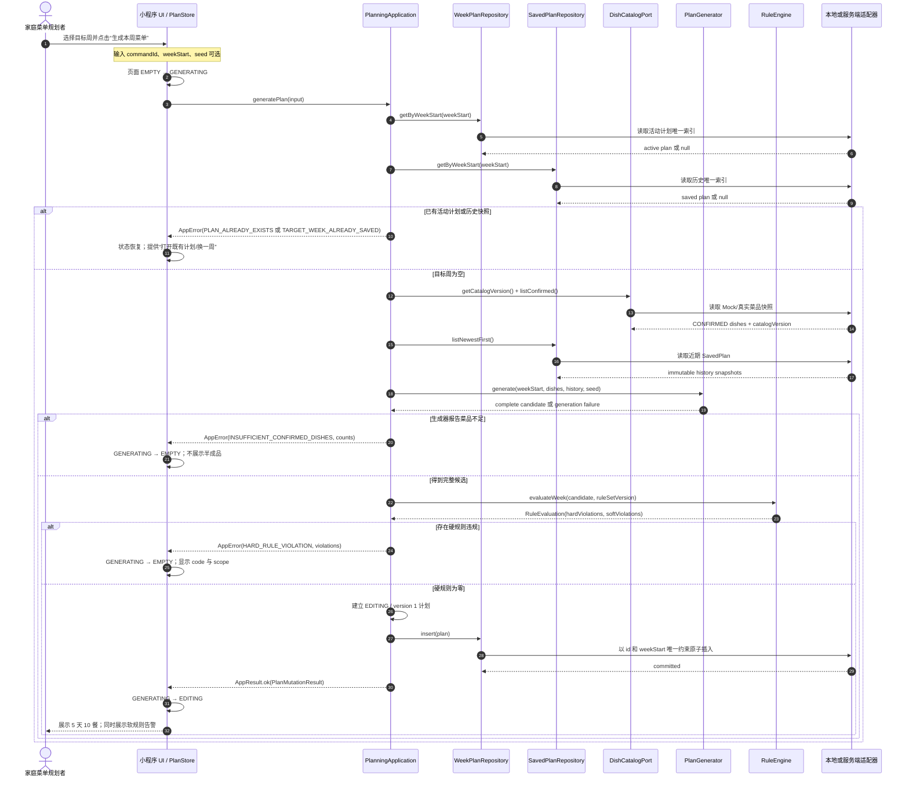
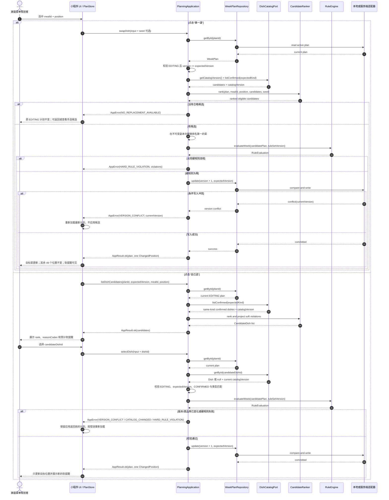
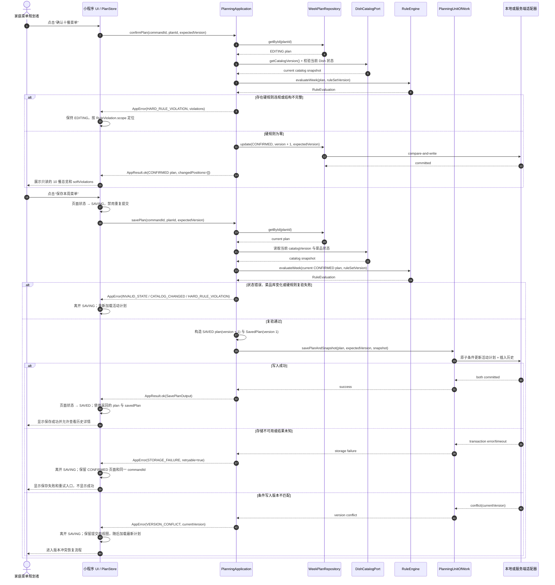
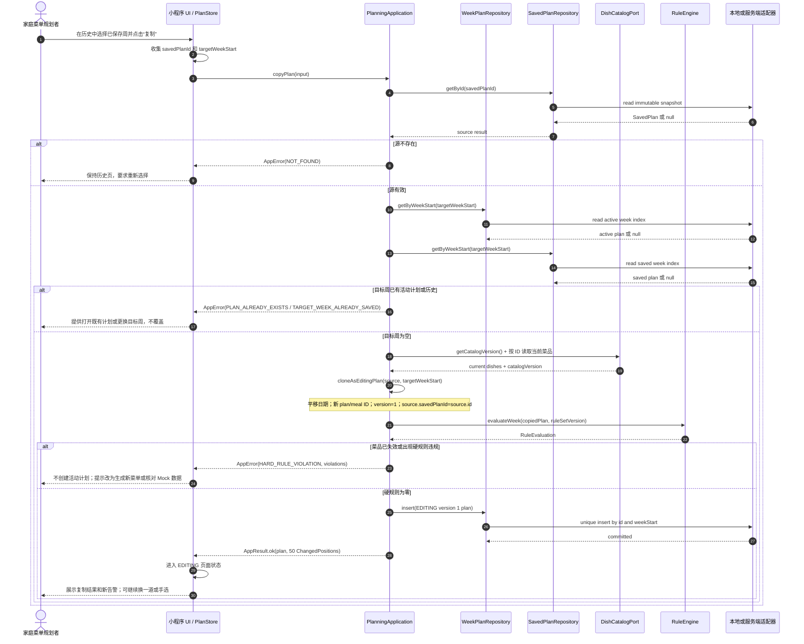
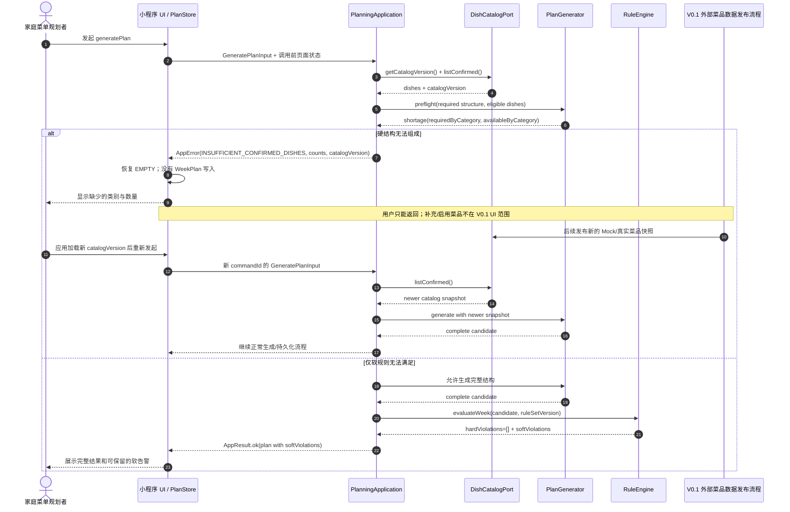
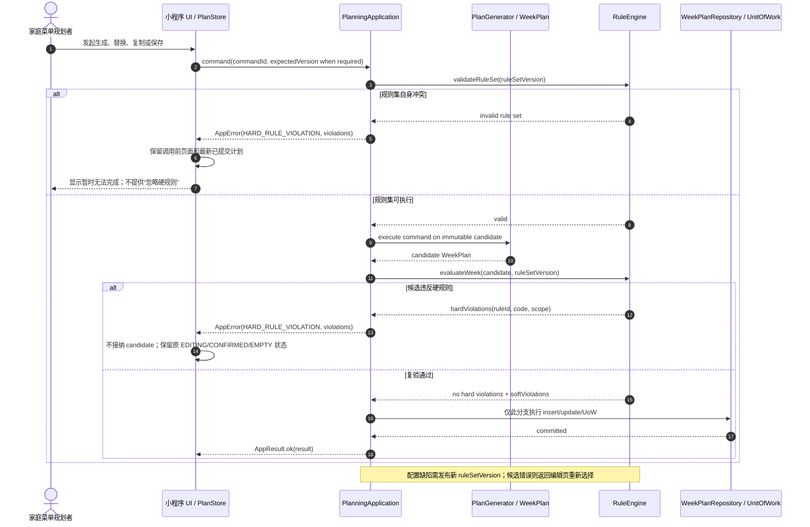
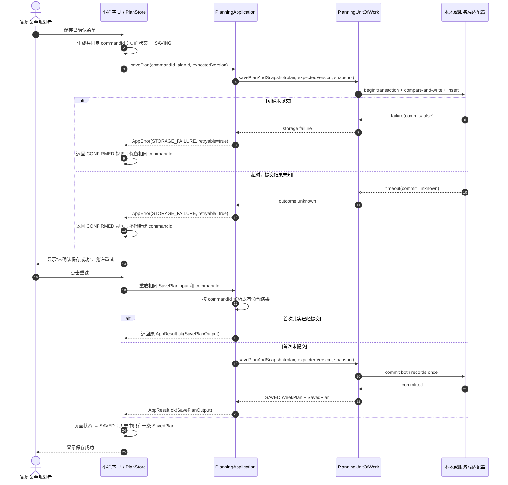
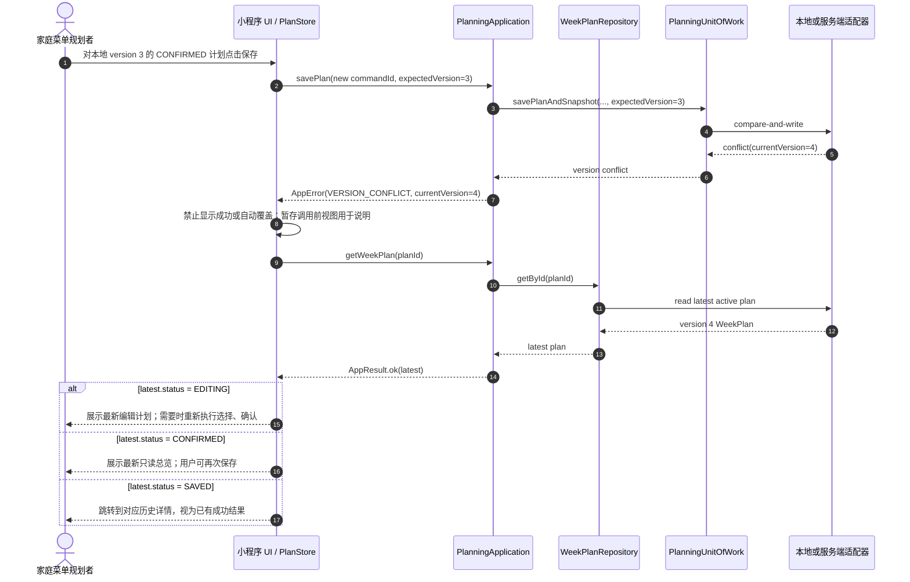

# 排好菜工程实现模型：动态流程

> 状态：待实现的工程约定，不是现有能力声明。现有客户原型只用本地示例数据演示高光路径；本文件描述后续实现应满足的调用、状态和失败语义。对象、状态、错误码和函数签名遵循 [contracts.md](./contracts.md)。

## 1. 共同约定

### 1.1 产品事实

- 目标周为周一至周五，共 10 个餐次；每餐固定 2 道荤菜、2 道素菜、1 道汤，共 50 个菜品槽位。
- 生成和换菜只能引用菜品库中的“已确认菜品”。
- 每餐结构、槽位完整、菜品可用性属于硬规则；近期使用、同一主料避重属于软规则，命中时给出告警，但不静默阻止用户继续。
- 换一道和手选只允许改变当前 `mealId + position`；其余 49 个位置保持不变。
- 保存成功后才形成历史 `SavedPlan`。进入确认页只代表活动 `WeekPlan` 已持久化为 `CONFIRMED`，不代表已经保存到历史。
- 第一阶段不包含登录、云同步、采购清单和菜品维护；出站端口先由本地 Mock 适配器实现，未来真实后端必须复用相同应用与错误契约。

### 1.2 参与组件

| 组件 | 职责 | 不负责 |
| --- | --- | --- |
| 小程序 UI / `PlanStore` | 收集用户输入、展示加载/编辑/只读/告警/错误，持有应用接口返回的最新 `WeekPlan` | 不自行生成菜单，不直接改领域对象 |
| `PlanningApplication` | 统一应用入口；编排用例、Repository、生成器与规则引擎；返回 `AppResult` | 不直接读写浏览器存储或拼接后端 URL |
| `PlanGenerator` | 根据目标周、固定餐次模板、候选菜和历史生成候选 `WeekPlan` | 不保存数据，不降级硬规则 |
| `CandidateRanker` | 为自动换菜和手选候选排序并解释预计软规则 | 不绕过最终整周校验 |
| `RuleEngine` | 对整周或一次替换返回硬规则违规和软规则告警 | 不修改 `WeekPlan`，不决定 UI 文案布局 |
| `DishCatalogPort` | 按 ID/类型返回 `CONFIRMED` 菜品和 `catalogVersion` | 不把 `DRAFT`/`DISABLED` 菜品伪装成候选 |
| `WeekPlanRepository` | 按周/ID读取活动计划；插入或按 `expectedVersion` 更新 | 不保存不可变历史快照 |
| `SavedPlanRepository` | 按周/ID读取和列出不可变 `SavedPlan` | 不修改历史快照 |
| `PlanningUnitOfWork` | 原子地把活动计划置为 `SAVED` 并创建 `SavedPlan` | 不承载生成或规则策略 |
| 本地/未来服务端适配器 | 实现端口的序列化、唯一约束、版本比较和原子提交 | 不改变跨层成功/错误语义 |

### 1.3 数据状态与并发标识

领域状态只使用 `WeekPlanStatus`：

| 状态 | 含义 | 允许的后继 |
| --- | --- | --- |
| `EDITING` | 生成或复制得到的活动计划；允许 `swapDish` / `selectDish` | 新版本 `EDITING`、`CONFIRMED` |
| `CONFIRMED` | 已通过完整硬规则校验的只读总览；尚未产生历史快照 | `EDITING`（`reopenPlan`）、`SAVED` |
| `SAVED` | 来源活动计划终态；同一事务已创建不可变 `SavedPlan` | 无；`SavedPlan` 可复制成另一周的 `EDITING` |

`EMPTY`、`GENERATING`、`SAVING`、`ERROR` 仅是 `PlanStore` 的页面状态，不得写入 `WeekPlan.status`。UI 的“准备保存”对应领域 `CONFIRMED`，不是一个额外领域状态。

- `WeekPlan.version` 是聚合版本：创建为 1，每次成功的换菜、手选、确认、重开或保存命令加 1；所有现有计划命令提交 `expectedVersion`。
- `commandId` 标识一次用户命令，也是未来远端幂等键。同一 ID 与相同输入重放应返回原结果；同一 ID 携带不同输入返回 `INVALID_INPUT`。
- `catalogVersion` 与 `ruleSetVersion` 分别标识菜品库和规则集，不得与聚合 `version` 混用。
- 失败返回 `AppError` 的稳定 `code`、结构化 `details`/`violations` 和 `retryable`，不得只返回展示文案。

本文件涉及的契约错误集合：

| 错误码 | 关键详情 | 是否可直接重试 |
| --- | --- | --- |
| `INSUFFICIENT_CONFIRMED_DISHES` | 按类型的需求/可用数量、`catalogVersion` | V0.1 流程内不能补菜；数据更新后重新发起 |
| `HARD_RULE_VIOLATION` | `violations` 中的 `ruleId`、`code`、`scope` | 修复输入/规则/菜品后重新发起 |
| `NO_REPLACEMENT_AVAILABLE` | `mealId`、`position`、已应用过滤条件 | 保留原菜单；可转手选后返回 |
| `VERSION_CONFLICT` | `expectedVersion`、`currentVersion` | 重新加载最新计划；禁止自动覆盖 |
| `PLAN_ALREADY_EXISTS` / `TARGET_WEEK_ALREADY_SAVED` | `weekStart`、既有记录标识 | 打开既有记录或换周，不覆盖 |
| `NOT_FOUND` / `INVALID_STATE` | 请求对象标识、当前状态 | 刷新列表/计划并重新选择 |
| `CATALOG_CHANGED` | 命令读取的版本与当前 `catalogVersion` | 重载菜品库和计划后再决定 |
| `STORAGE_FAILURE` | `operation`、受控诊断信息，不含底层异常文本 | 保留页面和输入；通常可重放同一 `commandId` |

## 2. 生成本周菜单

**输入**：`GeneratePlanInput { commandId, weekStart, seed? }`；`weekStart` 必须是周一。
**输出**：成功时返回 `PlanMutationResult`，其中计划为 `EDITING / version 1`、`changedPositions` 恰好 50 项、`source.type = GENERATED` 并回传实际 seed；失败时不写入活动计划。
**不变量**：目标周既没有活动 `WeekPlan` 也没有 `SavedPlan`；结果包含 10 个唯一餐次和 50 个完整位置；所有 `DishSnapshot` 来自同一 `catalogVersion` 的已确认菜品；`hardViolations` 为空。

失败处理：任何端口读取或插入失败归一为 `STORAGE_FAILURE`；唯一键竞争归一为 `PLAN_ALREADY_EXISTS` / `TARGET_WEEK_ALREADY_SAVED`。UI 回到 `EMPTY` 并允许按错误语义重试，不能把未提交或残缺候选放进编辑态。

## 3. 换一道与手选

**共同输入**：`planId`、`expectedVersion`、`mealId`、`position` 和 `commandId`；计划必须处于 `EDITING`。
**换一道**：`swapDish` 直接选择排名最高且硬规则有效的同类菜；不要求用户再确认候选。
**手选**：先用 `listDishCandidates` 展示候选，再把用户选定的 `dishId` 交给 `selectDish`。
**输出**：成功时 `changedPositions` 恰好 1 项、`WeekPlan.version + 1`、完整规则结果刷新；失败不更新 Repository。

实现检查点：`swapDish` 与 `selectDish` 可以有不同入站命令，但必须共享“不可变替换 → 完整规则求值 → 版本条件写入”的领域路径。候选查询不增版；成功替换才增版。客户端不得先局部改画面再异步补校验。

## 4. 确认与保存

**输入**：先提交 `ConfirmPlanInput`，再对返回的 `CONFIRMED` 版本提交 `SavePlanInput`；两个用户命令使用各自的 `commandId`。
**输出**：确认成功返回 `CONFIRMED / version + 1` 且 `changedPositions=[]`；保存成功返回 `SAVED WeekPlan` 和独立的不可变 `SavedPlan`。
**提交边界**：保存通过 `PlanningUnitOfWork` 在同一原子提交中更新活动计划并插入历史快照。只有该事务成功返回后，UI 才能显示“本周菜单已保存”。

若用户在只读总览点击“返回调整”，UI 调用 `reopenPlan`，把 `CONFIRMED → EDITING` 并增版，`changedPositions=[]`；重新修改后必须再次 `confirmPlan`，不能沿用旧确认版本直接保存。

## 5. 从历史复制后继续调整

**输入**：`CopyPlanInput { commandId, savedPlanId, targetWeekStart }`；复制源是不变的 `SavedPlan`，目标周必须同时没有活动计划和保存快照。
**输出**：插入新的 `EDITING / version 1 WeekPlan`；保留 50 个菜品快照和位置，平移日期，创建新计划/餐次 ID，`source = { type: COPIED, savedPlanId }`，`changedPositions` 为 50 项。
**重新校验**：复制按当前 `catalogVersion` 和 `ruleSetVersion` 复验；源快照当时合法不代表当前仍可复制。

复制会创建一个持久化的活动 `WeekPlan`，但不会创建历史 `SavedPlan`；只有后续 `confirmPlan → savePlan` 成功后才进入历史列表。复制源始终不变。

## 6. 菜品不足：诊断、保留状态与重试

菜品不足是当前 `catalogVersion` 的已确认菜品无法满足硬结构最低要求，不等于“软规则无法做到理想避重”。软规则无法满足时仍返回完整计划；只有硬结构无法组成时才返回 `INSUFFICIENT_CONFIRMED_DISHES`。V0.1 菜品库只读，流程内没有“补菜”动作。

## 7. 硬规则冲突：阻断与修复后恢复

硬规则冲突包括规则配置自身矛盾、复制/替换后出现不可接受的位置，或生成器返回未通过完整复验的候选。当前规则为只读，终端用户不能在“我的”页把硬规则降级。

失败必须留下可诊断证据：`requestId`、`ruleSetVersion`、`RuleViolation.ruleId/code/scope` 和命令类型。不得为了“总能生成”而自动把硬规则降级为软规则。

## 8. 存储失败：结果未知与幂等恢复

Mock 适配器可以注入“提交前失败”和“提交后超时”验证 UI 与幂等契约，但只有真实后端的事务/幂等证据才能证明跨进程持久化安全。

## 9. 版本冲突：读取最新版本，不静默覆盖

V0.1 不提供自动合并、强制覆盖或隐藏的“复制当前冲突对象”命令。若冲突来自结果未知的同一命令，客户端应先重放同一个 `commandId`；同一命令成功过时应返回原结果，而不是制造版本冲突。

## 10. 可观测性与流程关联

每个应用入口至少记录以下非敏感字段，供验收证据关联：

- `requestId`、操作名、开始/结束时间、结果码和耗时；
- `commandId`、`weekStart`、`planId` / `savedPlanId`（如有）、`expectedVersion` / 返回 `version`；
- `catalogVersion`、`ruleSetVersion`、确定性测试用 `seed`；
- 硬规则违规数、软规则告警数；
- 保存重放次数、`VERSION_CONFLICT.currentVersion` 和最终结果。

不得记录完整家庭偏好、未脱敏的存储错误或其他与本轮菜单验收无关的个人数据。
