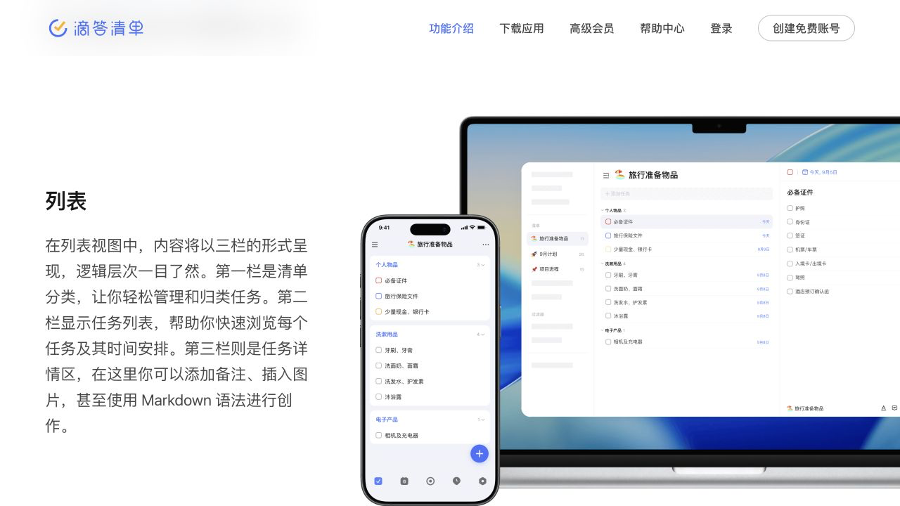

# 滴答清单产品调研：从待办生命周期到 AI 对话机会

> 研究对象：滴答清单（中国区）及其国际品牌 TickTick 的公开能力
>
> 结论日期与来源访问日期：2026-08-13
>
> 证据范围：官方官网、帮助中心、定价页、更新动态、Apple App Store 与 Google Play。未登录、未购买会员、未进行真实账户操作。
>
> 标注规则：未特别标注的功能描述均为**已核验事实**；“推断”是从官方材料归纳出的产品判断；“随口记建议”是未来产品机会，不代表滴答清单现状。

## 一、执行摘要

滴答清单不是单纯的“勾选列表”，而是一套覆盖任务完整生命周期的个人效率产品：先把想到的事快速放入收集箱，再用清单、文件夹、标签、优先级和日期等属性整理，通过今天、最近七天、日历、搜索、过滤器等视图决定下一步，最后完成、回顾或恢复任务。番茄专注、习惯、倒数纪念日、共享协作、日历订阅和多端入口则围绕这条主链扩展。官方将它称为“简单好用的时间管理工具”，列出的主模块包括任务、日历、四象限、番茄专注和习惯打卡。[滴答清单新手指南](https://help.dida365.com/articles/6950689598586486784)（访问：2026-08-13）

它的核心价值不是某个高级视图，而是三层模型彼此配合：**任务实体**保存要做什么和完成状态；**结构与属性**表达归属、语境、重要性和时间；**视图**按当下问题重新投影同一批任务。一个任务只能归属一个清单，却可带多个跨清单标签；过滤器再根据清单、日期、优先级、标签等条件动态筛选。[如何管理海量任务](https://help.dida365.com/articles/6950652964327391232)、[过滤器](https://help.dida365.com/articles/6950655961044353024)（访问：2026-08-13）

截至调研日，不能再把滴答清单描述成“只有日期自然语言识别的传统 Todo”。它已有三类智能能力：传统文本日期/时间识别；移动端 AI 语音添加，可抽取标题、日期、时间、清单、标签、优先级并拆分多任务；录音转写与总结。更关键的是，官方已提供滴答清单 MCP，让外部 AI 客户端在对话中读取、创建和管理任务，并示范查询、创建、批量完成、移动清单等意图。[AI 功能汇总](https://help.dida365.com/articles/7444671678778441728)、[AI 语音添加](https://help.dida365.com/articles/7444666114547646464)、[滴答清单 MCP](https://help.dida365.com/articles/7438132116019216384)（访问：2026-08-13）

**对“随口记”的核心推断：**“自然语言新增一条待办”已经不是充分差异点。更值得验证的是持续对话中的指代、批量整理、冲突识别、改期与复盘，以及在高风险操作前给出可理解的变更预览。对话适合表达意图和减少逐字段编辑；列表、日历、历史和确认界面仍负责总览、空间排程、消歧与可逆性。

## 二、产品与平台范围

### 2.1 名称与研究边界

- 中国区官方入口使用“滴答清单 / DIDA”，国际入口使用“TickTick”。Apple 中国区与美国区商店页面使用相同应用 ID `626144601`，分别显示滴答清单与 TickTick；两套官方帮助中心大量文章结构和能力相互对应。与此同时，它们使用不同官网域名，MCP 地址也分别为 `https://mcp.dida365.com` 与 `https://mcp.ticktick.com`。[中国区 App Store](https://apps.apple.com/cn/app/id626144601)、[美国区 App Store](https://apps.apple.com/us/app/id626144601)、[滴答清单 MCP](https://help.dida365.com/articles/7438132116019216384)、[TickTick MCP](https://help.ticktick.com/articles/7438129581631995904)（访问：2026-08-13）
- 两区法律与数据环境不能混同：滴答隐私政策的服务主体是杭州随笔记网络技术有限公司，并称从中国境内获得的信息存放于中国境内；TickTick 条款称服务由 Appest Inc. 提供，安全页称其数据库和服务器托管在美国 AWS。[滴答隐私声明](https://dida365.com/privacy?language=zh_cn)、[TickTick 使用条款](https://ticktick.com/tos?language=zh_CN)、[TickTick Security](https://ticktick.com/security?language=en_US)（访问：2026-08-13）
- **基于证据的推断：**滴答清单与 TickTick 属同一产品谱系、是面向不同市场的近乎同构版本，可以用国际官方资料交叉核验共同能力；但上述证据不能证明两区账号、订阅、数据或后台互通。本报告以滴答清单中文服务为准，TickTick 资料只用于交叉核验或补足公开说明。

### 2.2 定位、用户与场景

官方商店页把产品定位为轻便的 Todo / GTD 日程管理应用，覆盖项目计划、会议提醒、行程、备忘、购物清单、工作专注、习惯与协作。由此可见目标并非只面向项目团队，而是同时面向个人工作、学习、生活管理，以及轻量家庭/团队共享。[中国区 App Store](https://apps.apple.com/cn/app/id626144601)、[共享与协作](https://help.dida365.com/articles/6950648827183366144)（访问：2026-08-13）

### 2.3 平台与观察版本

| 范围 | 官方可核验状态 | 本报告边界 |
| --- | --- | --- |
| iPhone / iPad / Apple Watch | 中国区 App Store 同时列出三端；2026-08-13 页面显示当前版本 **8.1.40**，版本日期 2026-07-29 | 商店描述与版本记录可核验；没有安装实测 |
| Android / Wear OS | Google Play 的 TickTick 官方页列出 Android、Wear OS、Chromebook / 平板，页面显示 2026-07-01 更新 | 公开页未给安装包版本号；不同地区发布节奏可能不同 |
| HarmonyOS、Windows、macOS、Linux、Web、浏览器插件 | 中文官方下载页逐项列出 | 只核验“可下载/可使用”，不假设功能完全等同 |
| 其他入口 | 官方帮助还列出微信、Siri、邮件、剪贴板、系统快捷指令、小组件和智能手表 | 这些是捕捉/查看入口，不等同于完整客户端 |

来源：[滴答清单下载页](https://dida365.com/download?language=zh_CN)、[中国区 App Store](https://apps.apple.com/cn/app/id626144601)、[Google Play: TickTick](https://play.google.com/store/apps/details?id=com.ticktick.task)、[添加任务](https://help.dida365.com/articles/6950658877373284352)、[手表](https://help.dida365.com/external/articles/7069931247773941760)（访问：2026-08-13）。

## 三、功能地图

| 层级 | 主要能力 | 在任务生命周期中的作用 | 核心/扩展判断 |
| --- | --- | --- | --- |
| 捕捉与 Todo 核心 | 快速添加、收集箱、标题/详情、日期与时间、提醒、重复、优先级、完成、删除/恢复 | 把“记得要做”变成可执行、可提醒、可结束的任务 | **核心** |
| 组织与查看 | 文件夹、清单、分组、任务、子任务；标签、过滤器、搜索；今天/明天/最近七天；列表、看板、时间线、日历、四象限 | 处理任务增长后的归类、聚焦、排程和查找 | **核心**；部分高级视图是增强层 |
| 复杂任务内容 | 文本详情、Markdown、检查事项、附件、模板、笔记/任务转换 | 保存步骤、资料和上下文 | 核心增强；大附件与知识记录偏扩展 |
| 执行辅助 | 番茄专注、正计时、预计番茄、白噪音、统计 | 从“知道做什么”推进到“投入时间做” | **扩展**，不应阻塞基础 Todo |
| 习惯与长期目标 | 习惯频率/目标/打卡/日志、倒数纪念日 | 管理持续行为与重要日期 | **相邻独立模型**，不是普通任务的必需属性 |
| 协作 | 共享普通清单、成员权限、指派、评论、通知、任务/清单动态 | 让任务拥有责任人、沟通和变更追踪 | 个人 Todo 的扩展；轻协作而非完整项目管理平台 |
| 生态与入口 | 跨端同步、日历订阅/关联、Notion、导入导出、邮件、微信、Siri、快捷指令、小组件、MCP、CLI | 降低记录摩擦，让任务进入其他工作流 | 扩展，但“无处不在的捕捉”强化核心价值 |

功能范围来源：[官网功能页](https://www.dida365.com/about/features)、[帮助中心](https://help.dida365.com/)、[任务详情与编辑](https://help.dida365.com/articles/6950661731483910144)、[团队如何协作](https://help.dida365.com/articles/6950652002518958080)、[数据备份与迁移](https://help.dida365.com/articles/6950691573587771392)（访问：2026-08-13）。

## 四、五条核心流程

### 4.1 快速记录：先卸下记忆负担，再决定是否整理

1. 移动端随处可见的“+”和桌面端输入栏承担最短创建路径；可在创建时补日期、优先级、标签和所属清单。[添加任务](https://help.dida365.com/articles/6950658877373284352)（访问：2026-08-13）
2. 如果没有当场整理，任务可进入**收集箱**。官方把它定义为临时中转站，容纳来不及整理的任务，而且收集箱不可隐藏或删除。[用清单管理任务](https://help.dida365.com/articles/6950654234933067776)（访问：2026-08-13）
3. 文本中的日期和时间可被识别，并自动设置任务时间/提醒；识别结果可点按或删除取消，功能也可关闭。语音、小组件、桌面全局快捷键、微信消息、邮件、剪贴板和多行批量添加进一步缩短入口距离。[添加任务](https://help.dida365.com/articles/6950658877373284352)（访问：2026-08-13）
4. 2026 年新增的 AI 语音模式会在保存页展示解析结果；单条需查看后保存，多条会拆分并允许逐条移除后批量保存。这里的**预览再落库**是值得“随口记”借鉴的安全模式。[AI 语音添加](https://help.dida365.com/articles/7444666114547646464)（访问：2026-08-13）

### 4.2 组织整理：归属、属性和层级不是一回事

官方给出五级结构：**文件夹 → 清单 → 分组 → 任务 → 子任务**。文件夹收纳清单；每个任务必须归属一个清单；分组是清单内的小分类；子任务是仍可拥有日期、详情、标签、优先级、指派等属性的任务实体。标签则是可跨清单、多选的属性；过滤器是按规则动态生成的结果集。[如何管理海量任务](https://help.dida365.com/articles/6950652964327391232)、[多级任务](https://help.dida365.com/articles/6950660746367729664)（访问：2026-08-13）

各属性解决的问题不同：

| 属性 | 回答的问题 | 注意点 |
| --- | --- | --- |
| 收集箱 | “我还没想好放哪儿” | 是暂存状态，不是长期分类法 |
| 清单 | “这件事属于哪个项目/生活领域” | 单一归属，可共享普通清单 |
| 文件夹 | “哪些清单属于同一大类” | 管的是清单，不直接替代任务标签 |
| 标签 | “它还具有什么跨项目语境” | 一项任务可多个标签，可建二级标签 |
| 优先级 | “它有多重要” | 高、中、低、无四级；不等于日期的紧迫性 |
| 日期/时间 | “计划何时发生或到期” | 决定今天/最近七天等时间视图中的出现位置 |
| 提醒 | “何时主动打断我” | 是通知触发点，可与任务时间不同，且依赖系统通知条件 |

来源：[用标签管理任务](https://help.dida365.com/articles/6950656299306582016)、[任务详情与编辑](https://help.dida365.com/articles/6950661731483910144)、[提醒功能](https://help.dida365.com/articles/6950660229746917376)（访问：2026-08-13）。

### 4.3 时间与提醒：四个容易混淆的概念

1. **日期/任务时间**决定任务被安排在哪天；也可设具体时刻。官方界面统一从“日期&重复”进入。
2. **时间段**有开始和结束，可为同日（如 9:00–12:00）或跨天；它表达占用时间，而不是第二条任务。[任务详情与编辑](https://help.dida365.com/articles/6950661731483910144)（访问：2026-08-13）
3. **提醒**是通知时间。一个任务可以有多个提醒；“任务在周五到期”和“周四提前提醒”不应在对话解析时混为一谈。[提醒功能](https://help.dida365.com/articles/6950660229746917376)（访问：2026-08-13）
4. **重复规则**决定后续周期如何产生。到期重复锚定原计划日；完成重复从真实完成日重新计算；自选日期重复选择离散日期，还可按日期或次数结束。修改一个周期时可选择“仅此周期”。[设置重复任务](https://help.dida365.com/articles/6950660365923385344)（访问：2026-08-13）

自然语言识别只是把一句话映射到这些字段，并没有消除概念差异。例如“明天下午三点交报告”可以稳定解析为任务日期/时间；“明天下午三点前提醒我交报告”究竟是三点到期还是三点提醒，语义不同。**随口记建议：**在“前、开始、持续、提前、每隔、做完后再过”等词出现时，把解析出的任务时间、提醒和重复锚点分行回显；不能确定就追问，而不是静默猜测。

另有跨时区语义：固定时区保持绝对时刻，换地区后显示为当地换算时间；固定时间则无论身处哪里都保持当地钟表时间。[固定时间与固定时区](https://help.dida365.com/articles/7082246235360329728)（访问：2026-08-13）

### 4.4 执行与完成：从“今天做什么”到可逆结束

- “今天”“明天”“最近七天”是按日期筛选的智能清单；今天清单还可分组/排序，让临近或高优任务靠前。新版“推荐任务”根据近期创建、多次改期、长期未完成和即将到期等类别，帮助用户把任务加入今天。[用清单管理任务](https://help.dida365.com/articles/6950654234933067776)、[推荐任务](https://help.dida365.com/articles/7401559568137846784)（访问：2026-08-13）
- 日历把有时间的任务放进空间化时间轴，并支持拖动改期；番茄专注可从任务详情启动并关联专注记录。它们分别解决“放进哪段时间”和“现在持续做一段时间”。[周视图](https://help.dida365.com/articles/6950641140068515840)、[任务详情与编辑](https://help.dida365.com/articles/6950661731483910144)（访问：2026-08-13）
- 列表中右滑可完成任务；协作通知明确区分“完成/取消完成”，说明完成可撤销。已完成任务有独立智能清单；任务动态记录从创建到完成的修改。[列表视图](https://help.dida365.com/articles/6950656708259610624)、[团队如何协作](https://help.dida365.com/articles/6950652002518958080)、[常见问题](https://help.dida365.com/articles/6950670128287580160)（访问：2026-08-13）
- “放弃”不同于“删除”：放弃的任务进入已放弃清单，日后可重新开始；删除的任务进入垃圾桶并可恢复。公开帮助没有完整展示垃圾桶保留期限、彻底删除和批量恢复规则，列为证据缺口。[任务详情与编辑](https://help.dida365.com/articles/6950661731483910144)、[常见问题](https://help.dida365.com/articles/6950670128287580160)（访问：2026-08-13）

### 4.5 搜索与回顾：已知目标用搜索，重复问题用视图

- 搜索可查任务、清单、标签；查任务时能组合清单、标签、优先级、日期，常用条件可保存为过滤器。[搜索任务](https://help.dida365.com/articles/7473271683613196288)（访问：2026-08-13）
- 过滤器支持“且/或”与关键词，适合反复查看“下周且高优先级”“工作清单中带某标签”等动态集合。[过滤器](https://help.dida365.com/articles/6950655961044353024)（访问：2026-08-13）
- 列表用于线性扫描和批量处理；看板用于按组理解状态；时间线用于跨日项目；日历的周/月/年/列表等视图用于时间容量和历史分布；任务动态用于追溯单项变更。[不同的视图查看任务](https://help.dida365.com/articles/6950656395750408192)、[日历](https://help.dida365.com/articles/6950361611617959936)（访问：2026-08-13）

## 五、复杂任务、协作与状态细节

### 5.1 子任务、检查事项、详情和附件

| 能力 | 适合什么 | 关键差异 |
| --- | --- | --- |
| 子任务 | 可独立安排、提醒、指派的工作包 | 最多五级；像普通任务一样有时间、详情、标签、优先级等 |
| 检查事项 | 同一任务内的轻量步骤/核对项 | 可排序、删除、单独设提醒；全部完成会自动完成主任务 |
| 任务详情/备注 | 背景、链接、说明和长文本 | 支持样式/Markdown；不需要完成状态 |
| 附件 | 图片、录音、文件、视频等资料 | 跟随任务跨端同步；免费/付费额度不同 |
| 评论 | 协作沟通和带时间戳的补充 | 主要位于共享清单，可 @ 成员并通知 |

特别注意：当子任务与检查事项同时存在时，官方说明只有检查事项完成度影响主任务进度；检查事项全部完成会自动完成主任务，子任务完成并不自动决定主任务完成。这种不直观规则不宜原样搬进对话产品。[多级任务](https://help.dida365.com/articles/6950660746367729664)、[任务详情与编辑](https://help.dida365.com/articles/6950661731483910144)（访问：2026-08-13）

### 5.2 共享、指派与历史

只有用户创建的普通清单可共享；今天、明天等智能清单和收集箱不可共享。共享后可设可编辑、可评论、只读权限，创建或批量选择任务后可指派执行者；评论和 @ 会进入通知中心。任务动态追踪单项从创建到完成的变更和责任人，清单动态目前只在电脑端查看。[如何共享清单](https://help.dida365.com/articles/6950649257581871104)、[团队如何协作](https://help.dida365.com/articles/6950652002518958080)（访问：2026-08-13）

## 六、关键页面与交互证据

*图 1：滴答清单官方公开功能页“多种视图 → 列表”的营销演示图，桌面浏览器视口，访问 2026-08-13；来源：[官方功能页](https://www.dida365.com/about/features)。图中可见桌面端的清单分类、任务列表、任务详情三栏关系，以及移动端对应列表。它不是登录账户后的实测截图，不能证明字段默认值、实际数据或所有平台当前 UI 完全一致。*

这张图支持一个重要结构判断：左侧回答“任务放在哪里”，中间回答“这一范围有哪些任务”，右侧回答“当前任务具体是什么”。对话可以替代部分右侧字段编辑，却难以持续替代中间列表的扫描、比较和多选；因此“聊天 + 可展开结果列表/任务卡”比纯聊天记录更适合作为随口记的基础形态。

## 七、免费/付费与平台差异

### 7.1 已被官方资料证实的账户差异

| 维度 | 普通用户 | 高级会员 | 证据与边界 |
| --- | --- | --- | --- |
| 基础使用 | 可免费注册、创建任务与清单 | 解锁高级功能 | [账号与安全](https://help.dida365.com/articles/6950657111692935168) |
| 日历与排程 | 公开页没有给出完整免费视图矩阵 | 月视图、时间线、任务开始/结束时间、订阅其他日历列为会员卖点 | [高级会员页](https://dida365.com/upgrade?language=zh_CN)；不能反推所有未列视图都收费 |
| 自定义组织 | 基础清单、标签等可用 | 更多清单/任务容量，过滤器和自定义筛选规则 | [高级会员页](https://dida365.com/upgrade?language=zh_CN) |
| 容量 | 官方当前页面未完整列出普通上限 | 299 清单、每清单 999 任务、每任务 199 检查事项 | [高级会员页](https://dida365.com/upgrade?language=zh_CN) |
| 历史与统计 | 公开页未完整说明范围 | 任务/清单动态、更多周期历史统计列为会员权益 | [高级会员页](https://dida365.com/upgrade?language=zh_CN) |
| 共享人数 | 每个共享清单可加入 1 位成员 | 清单所有者为会员时最多 29 位成员；其他成员不必付费，但不能使用高级功能 | [常见问题](https://help.dida365.com/articles/6950670128287580160)、[团队协作](https://help.dida365.com/articles/6950652002518958080) |
| 附件 | 每日与单文件额度较低 | 每日与单任务额度、单文件大小更高 | 专门功能页称普通每日 1 个、单文件 10MB；付费每日 199 个、每任务 39 个、20MB，但 FAQ 另有“99”旧/冲突片段，精确值需产品内复核：[任务详情与编辑](https://help.dida365.com/articles/6950661731483910144) |
| 其他会员权益 | — | 检查事项提醒、日历小部件、预计番茄、会员主题、番茄白噪音、Android 悬浮球等 | [高级会员页](https://dida365.com/upgrade?language=zh_CN) |

访问日价格也因渠道不同：中文官网会员页显示一年 **￥139**；中国区 App Store 描述显示 **￥16/月或￥168/年**。两者都是访问日展示值，不代表长期固定价格，也不能据此推断其他平台或促销价格。[高级会员页](https://dida365.com/upgrade?language=zh_CN)、[中国区 App Store](https://apps.apple.com/cn/app/id626144601)（访问：2026-08-13）

### 7.2 已证实的平台差异示例

- AI 语音添加明确标注**仅移动端**；传统文本日期识别、MCP 与跨端同步是不同层面的能力。[更新动态](https://help.dida365.com/articles/6950689674532749312)（访问：2026-08-13）
- 位置提醒帮助说明目前仅 iOS 支持，Android 因耗电与精度暂不计划支持。[常见问题](https://help.dida365.com/articles/6950670128287580160)（访问：2026-08-13）
- 本地日历设置目前只在 Android、iOS、macOS 客户端提供。[本地日历](https://help.dida365.com/articles/7193075395720118272)（访问：2026-08-13）
- 清单动态只在电脑端查看；Web 端没有番茄白噪音；Android 手表不支持番茄专注。[团队如何协作](https://help.dida365.com/articles/6950652002518958080)、[如何保持专注](https://help.dida365.com/articles/6950412778679042048)、[手表](https://help.dida365.com/external/articles/7069931247773941760)（访问：2026-08-13）
- 小组件类型随 iOS、Android、HarmonyOS、macOS、Windows 和手表系统变化，不能将某端小组件当作全平台共有。[小组件](https://help.dida365.com/articles/6950366960659988480)（访问：2026-08-13）

## 八、截至 2026-08-13 的自然语言与 AI 能力边界

| 能力 | 已核验事实 | 不应夸大的边界 |
| --- | --- | --- |
| 传统智能识别 | 快速添加时识别文本中的日期、时间并设置提醒，可取消或关闭 | 公开说明未称其能理解任意复杂多轮语义 |
| AI 语音添加 | 移动端自然语音抽取标题、日期、时间、清单、标签、优先级；一段话可拆多任务；保存前可逐条检查 | 只证明“创建/拆分”流程；有月度 AI 额度，但公开资料未给各套餐精确次数 |
| AI 录音 | 录音附件可转写带时间戳文本、生成结构化总结，支持 30 多种语言；结果可复制/加入描述 | 这是任务附件处理，不等同于自动创建行动项或完整会议代理 |
| 滴答清单 MCP | 外部兼容 AI 客户端可经 OAuth 或 Bearer Token 连接；官方示例包括查今天/本周/历史任务，创建多任务，更新状态，移动清单；工具覆盖任务、清单、习惯、专注记录、纪念日基础操作 | 仅支持 Streamable HTTP；客户端和部分客户端套餐有前置条件；官方明确“其他高级功能暂未支持”；模型可能误解、选错工具或传错参数 |
| DIDA CLI | 可在终端管理任务/项目，也可供 AI Agent 调用；主要支持任务、清单、习惯、专注记录、纪念日基础操作 | 需要安装 Node.js、CLI 与授权；不是面向普通用户的内置聊天界面 |
| 隐私与数据处理 | 隐私声明称 AI 功能只在主动使用时处理所选内容，会将必要输入传给第三方 AI 服务；称不用于模型训练，并描述 AI 助手可能访问任务、清单、习惯及保留当前对话周期历史 | 公开隐私文本提到“AI 助手”，但当前 AI 功能汇总主要列语音、录音、MCP、CLI；没有足够公开界面证据证明滴答 App 内已有通用多轮任务聊天入口 |

来源：[添加任务](https://help.dida365.com/articles/6950658877373284352)、[AI 语音添加](https://help.dida365.com/articles/7444666114547646464)、[AI 录音总结](https://help.dida365.com/articles/7444668968427585536)、[滴答清单 MCP](https://help.dida365.com/articles/7438132116019216384)、[DIDA CLI](https://help.dida365.com/articles/7464976698707017728)、[隐私声明](https://dida365.com/privacy?language=zh_cn)（访问：2026-08-13）。

## 九、面向“随口记”的对话能力映射

以下全部是**未来机会映射**，不是滴答清单未具备能力的断言。滴答 MCP 已经证明查询、创建、更新、移动与完成可以由外部 AI 对话承接；“随口记”需要在连续上下文、确认策略和视觉回退上做出更完整体验。

| 用户说法 | 对应任务操作 | 建议确认 | 是否仍需视觉界面 |
| --- | --- | --- | --- |
| “明天下午三点提醒我交报告” | 新建任务；解析标题、任务时间、提醒 | 若“提醒时间=任务时间”可用简短回执；“三点前/提前”需澄清 | 任务卡足够，不必打开完整表单 |
| “周六买菜，顺便取快递，下周一交水费” | 拆成 3 条任务并分配日期 | 保存前给三行预览，可删改单条 | 需要紧凑批量预览 |
| “以后每次做完三天后再提醒我健身” | 建完成重复规则 | 必须回显“按完成日 +3 天”，首次日期缺失则追问 | 规则摘要卡；复杂规则可展开编辑器 |
| “我今天有什么必须做的？” | 查询今天、逾期、高优先级并排序 | 不需确认，只说明筛选口径 | 结果超过约 5 条时需要列表；时间冲突需日历 |
| “把刚才那三个都放到生活清单，加上办事标签” | 批量移动清单、加标签 | 回显命中数量和变更前后；同名清单需消歧 | 多选结果/变更预览必要 |
| “把没做完的都推到下周” | 批量改期 | 高风险且范围模糊，必须先列数量、范围和新日期；重复任务另行确认 | 必须有批量预览和取消 |
| “买牛奶做完了” | 查找唯一任务并完成 | 唯一、近期任务可执行后提供撤销；多条同名先让用户选 | 一条任务卡；歧义时显示候选列表 |
| “刚才那个别算完成” | 取消完成 | 利用近轮上下文，回执即可；上下文失效则展示候选 | 需要可撤销回执和历史入口 |
| “删掉那些没用了的任务” | 搜索候选并移入垃圾桶 | 删除条件主观且范围大，必须逐批确认；不可静默永久删除 | 必须显示候选、数量和恢复期限 |
| “帮我安排明天，别跟会议撞车” | 读取固定事项、估算容量、建议任务时间段 | 先给方案，用户确认后批量改期 | **日历不可替代**，需看冲突与空档 |
| “把准备搬家拆成步骤” | 生成子任务或检查事项 | 先问步骤是否需独立日期/负责人，以决定子任务还是检查事项 | 树状/清单预览有助于调整 |
| “把采购任务交给小王” | 在共享清单中指派成员 | 同名成员/任务先消歧；指派影响他人，执行前确认 | 成员与权限界面仍有必要 |
| “总结我这个月都忙了什么” | 查询已完成、延期、清单/标签/专注记录并归纳 | 只读无需确认，但要说明数据范围和缺失 | 图表/分组列表有助于验证 AI 总结 |

建议的交互原则：

1. **低风险、唯一命中的操作**可以直接执行并给可撤销回执，例如新增一条、完成唯一任务。
2. **高歧义或批量写操作**先计划后执行，明确将影响哪些任务、哪些字段，以及重复任务作用于单次还是整组。
3. **删除、共享、指派和大范围改期**必须确认；“确认”要展示差异，不只是问一句“确定吗”。
4. 对话不应成为唯一事实界面。任务列表、日历、候选选择、批量预览、任务历史和垃圾桶是 AI 出错时的校验与恢复通道。

## 十、借鉴、改造与不照搬

| 判断 | 滴答清单做法 | 对随口记的处理 | 理由 |
| --- | --- | --- | --- |
| 直接借鉴 | 收集箱先捕捉后整理 | 默认接住不完整表达，允许稍后补属性 | 把记录摩擦与整理成本解耦 |
| 直接借鉴 | 清单=单一归属，标签=多值属性，视图=动态投影 | 保持底层语义清晰，即使用户只用自然语言 | AI 需要稳定模型才能避免越整理越乱 |
| 直接借鉴 | 完成可撤销、删除可恢复、任务有动态 | 所有 AI 写操作生成变更记录和撤销入口 | AI 的概率性需要可逆底座 |
| 直接借鉴 | AI 语音多任务保存前预览 | 对多意图采用逐条预览、单条删除/修改 | 避免“一句话错建一串任务” |
| 需要改造 | 日期、提醒、重复集中在多层设置中 | 对话中显式复述“什么时候做/什么时候提醒/如何重复” | 自然语言更省操作，但更易混淆语义 |
| 需要改造 | 五级任务结构 + 标签 + 过滤器 | 默认只暴露任务、清单和日期；需要时再引入标签/层级 | 初学者不应先学习完整信息架构 |
| 需要改造 | 子任务与检查事项并存且进度规则不对称 | 用“是否需要独立日期/负责人”帮助选择，并让进度规则可见 | 避免用户不知道为什么主任务自动完成或未完成 |
| 需要改造 | MCP 把对话能力交给外部客户端 | 将常用任务意图、确认和结果视图做成连续的一体体验 | 降低配置、授权、工具选择和跨应用成本 |
| 不宜照搬 | 为每种效率方法持续增加顶级模块 | 首阶段守住记录、查询、整理、改期、提醒、完成 | 番茄、习惯、纪念日各自会扩大模型和导航 |
| 不宜照搬 | 让所有操作依赖层级菜单和字段面板 | 高频操作优先对话/快捷入口，复杂空间决策再切换界面 | “随口记”的价值是减少机械编辑，不是复刻 UI |
| 不宜照搬 | 把 AI 建议直接等同于用户计划 | 建议与已提交状态分开，用户确认后才改变日程 | 排程会影响承诺、提醒和他人协作 |

## 十一、证据缺口与待验证问题

1. **未登录实测。** 本报告没有验证首次使用、默认清单、默认日期、完成动画、取消完成入口、垃圾桶保留期限、批量恢复和权限错误等当前真实交互。
2. **版本与平台发布不齐。** iOS 商店可锁定 8.1.40；Google Play 公开页只有更新日期，没有 Android 版本号；Windows、macOS、Linux、HarmonyOS、Web 的当前版本和功能矩阵未见统一官方表。
3. **免费/付费矩阵不完整。** 官网会员页重点列会员卖点，不是一张穷尽式对照表，不能仅凭“未列出”判断免费版没有某功能。
4. **附件配额冲突。** 专门任务详情页写高级会员每日 199 个附件，但 FAQ 搜索片段仍出现 99；应以应用内当前提示或客服书面答复核验，本文只采纳“会员额度更高”的稳定结论。
5. **价格是动态渠道值。** 官网 ￥139/年与 iOS ￥168/年并存；税费、促销、自动续费和其他平台价格未逐项核验。
6. **内置通用聊天入口未证实。** 隐私声明提及 AI 助手和对话周期历史，但当前公开 AI 功能导航主要展示语音、录音、MCP、CLI。没有足够公开界面证据证明滴答 App 内已经提供与随口记设想等价的通用多轮聊天。
7. **MCP 细粒度边界。** 公开页展示工具类别与示例，但没有在无需授权的正文中列出每个工具 schema、事务/批处理原子性、恢复策略、速率限制和所有字段；也未实测模型误操作后的用户体验。
8. **AI 商业限制。** AI 录音页只说明月度额度，没有公开免费/会员各自的次数、音频长度和区域可用性完整表。
9. **提醒可靠性。** 官方帮助明确 Android 后台、安全软件和系统通知权限会影响提醒；公开资料不能证明所有厂商设备上准时送达。
10. **跨区关系。** 相同 Apple 应用 ID 和镜像文档能证明产品家族关系，但不能证明滴答清单与 TickTick 账号、订阅、数据或 MCP Token 互通。

## 十二、核心官方来源索引

- 产品与平台：[滴答清单官网](https://dida365.com/)、[功能页](https://www.dida365.com/about/features)、[下载页](https://dida365.com/download?language=zh_CN)、[中国区 App Store](https://apps.apple.com/cn/app/id626144601)、[Google Play](https://play.google.com/store/apps/details?id=com.ticktick.task)
- 任务与组织：[添加任务](https://help.dida365.com/articles/6950658877373284352)、[任务详情与编辑](https://help.dida365.com/articles/6950661731483910144)、[如何管理海量任务](https://help.dida365.com/articles/6950652964327391232)、[多级任务](https://help.dida365.com/articles/6950660746367729664)
- 时间、查看与状态：[提醒功能](https://help.dida365.com/articles/6950660229746917376)、[重复任务](https://help.dida365.com/articles/6950660365923385344)、[智能清单](https://help.dida365.com/articles/6950654234933067776)、[搜索任务](https://help.dida365.com/articles/7473271683613196288)、[日历](https://help.dida365.com/articles/6950361611617959936)
- 协作与生态：[团队如何协作](https://help.dida365.com/articles/6950652002518958080)、[数据备份与迁移](https://help.dida365.com/articles/6950691573587771392)、[小组件](https://help.dida365.com/articles/6950366960659988480)
- 价格与版本：[高级会员页](https://dida365.com/upgrade?language=zh_CN)、[更新动态](https://help.dida365.com/articles/6950689674532749312)
- AI：[AI 功能汇总](https://help.dida365.com/articles/7444671678778441728)、[AI 语音添加](https://help.dida365.com/articles/7444666114547646464)、[AI 录音总结](https://help.dida365.com/articles/7444668968427585536)、[滴答清单 MCP](https://help.dida365.com/articles/7438132116019216384)、[DIDA CLI](https://help.dida365.com/articles/7464976698707017728)、[隐私声明](https://dida365.com/privacy?language=zh_cn)

以上链接均于 2026-08-13 访问。关键事实已在正文就近引用；本索引仅便于复查，不代替正文中的证据边界。
